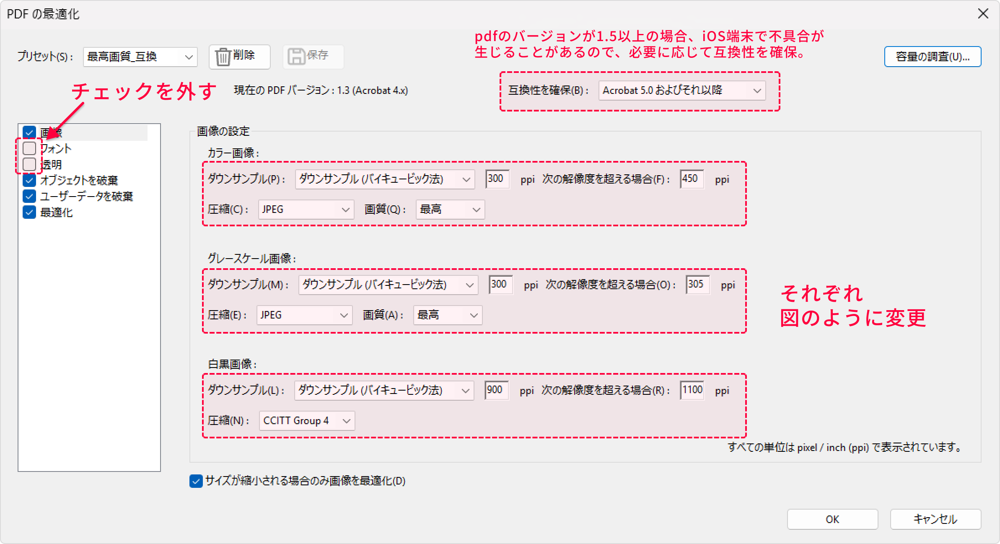

<aside class="bulb">
  

  ここで紹介する設定は、無償版の「Acrobat Reader」では使えません！

  大学の共有デバイスライセンスでAdobeにログインして、「Acrobat Pro」になっている場合は使えます。
  

</aside>

# 設定

---

1. 「Acrobat Pro」で、左上のメニューを開きます。
2. 「その他の形式で保存」>「最適化されたPDF」を開きます。    

    
3. 以下の画像のように設定します。

    
    
    「互換性を確保」の部分についてはデフォルトでも良いですが、iOSの上で読む場合がある場合はpdfのバージョンは1.4以下にする必要があります（2025年現在）。    
    特に、Adobe以外でpdfを開く必要がある場合は設定しておくとよいです。

4. 設定後に上部の「保存」を押すと、この設定を名前を付けて保存できます。 
   ※次回以降に起動したときにもこの設定は引き継がれます。
5. 設定が完了したら「OK」を押します。名前を付けて保存すれば、pdfが縮小されます。

# どのくらい効果があるか

---

ファイルの内容にもよりますが、写真や画像を多く含むpdfほど効果が出ます。

上記の画像では、元のファイルが52 MBあるのに対し、最適化操作によって40 MBまで軽量化されています。

画質のレベルを最高にしているので、画像の劣化を抑えて軽量化できるのでおすすめです。