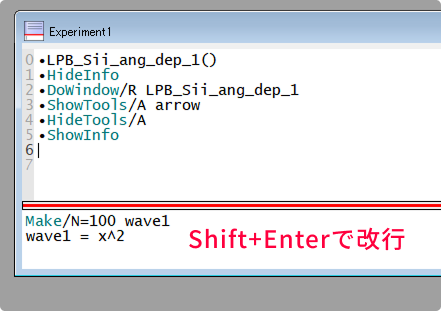

### コマンドウィンドウの表示

---

コマンドウィンドウは、ショートカットを使うことで素早く開くことができます。

- **ショートカットキー**
    - Windows: `Ctrl + J`
    - macOS: `Command + J`

また、メニューから **Window → Command Window** を選択することでも開けます。


### コマンドの打ち方

---

コマンドウィンドウでは、様々な方法でコマンドを入力できます。

- **通常の入力**  
    基本的には、1行ごとにコマンドを入力し、Enterで実行します。

    ```igor
    Print "Hello, Igor!"
    ```

- **Shift+Enter で改行**  
    複数のコマンドを一気に打ち込むこともできます。  
    複数行に分けるときはShift+Enterです。

    ```igor
    Make/N=100 wave1
    wave1 = x^2
    ```
    
    

- **セミコロン (;) で1行に複数のコマンドを記述**  
    複数のコマンドは、複数行に分けるやり方のほかに、セミコロンで区切る方法もあります。  
    実行される操作に違いはありません。


    ```igor    
    Make/N=100 wave1; wave1 = x^2
    ```
