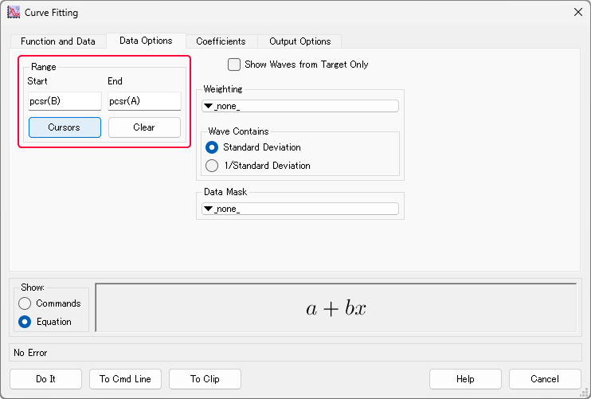

### カーソルを配置

---

カーソルをグラフ上に配置すると、グラフ上の数値を直接読み取ることができます。  
特定のポイントの値を確認するのに便利です。  

カーソルのメニューは、Ctrl+I (Win)またはcommand+I (mac) のショートカットキーで表示できます。  

カーソルは同時に2つまで使うことができます。

### カーソルで値を読む

---

<aside class="">
  

  ①カーソル。クリックすると、選択と非選択を切り替えられる。 
  ②現在のカーソル位置のインデックス。 
  ③現在のカーソル位置のxy値。  
  

</aside>

- カーソルを設置した状態で左右キー（←や→）を押すと、カーソルを移動できる。
  その際、①が選択状態（黒色）になっているカーソルだけが移動する。
- ②のポイント数を手入力すると、カーソルが指定した位置に移動する。

### カーソルの設定の変更

---

カーソルの設定を変更すると、より細かい調整が可能になります。  

カーソル設定は、
- グラフ下部のメニューの設定ボタン
- 下部メニューのカーソルの上で右クリック

のいずれかで変更できます。

　
<aside class="">
  

  ①カーソルを当てるwaveを選択できる。 
  ②カーソルの移動方法変更。 
  ③カーソルの見た目変更。  
  

</aside>

例えば、②でFreeにチェックすると、カーソルがデータ点のある位置だけではなく、自由な位置に指定することができます。

### フィッティングなどの解析に使う

---

カーソルは、特定範囲のデータに対してフィッティングを行うときにも便利です。

1. フィッティングしたい範囲の両端に2つのカーソルを置く。
2. 上部メニューのAnalysis>Curve Fittingからフィッティングメニューを開く。
3. Function and Dataタブで、フィッティングするwave等を選ぶ。
4. Data OptionsタブのRangeで、Cursorsをクリック。カーソル位置に範囲を指定できる。

