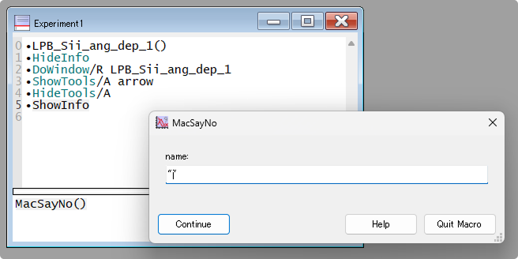

### はじめに

---

MacroとFunctionは、どちらもプロシージャウィンドウからテキストを入力して作成されます。

それぞれは名称、パラメータリスト、パラメータ宣言、本体コードを持ち、非常に類似した構文で書かれます。

Functionは復帰値を返すような記述が一般的であるのに対し、Macroでは復帰値（return）が使えないという点が大きな構文上の違いです。

### MacroとFunctionの基本構文

---

MacroとFunctionは似たような構文で記述されます。

1. Procedureに次のように書きます。
    
    ```igor
    // Macroの例
    Macro MacSayNo(name)
      String name
      Print "No " + name
    End
    
    // Functionの例
    Function FuncSayNo(name)
      String name
      Print "No " + name
    End
    ```
    
2. コマンドラインから次のように入力して、MacroとFunctionを実行できます。
    
    ```igor
    MacSayNo("Music"); FuncSayNo("Life")
    ```
    
3. すると、コマンドラインに次のように結果が出力されます。
    
    ```igor
    No Music
    No Life
    ```
    

この結果を見ると、MacroとFunctionは同じもののように見えます。しかし、実際には以下のような重要な違いがあります。

### MacroとFunctionの主な違い

---

MacroとFunctionの大まかな違いを表にしました。

| **項目** | **Function** | **Macro** |
| --- | --- | --- |
| **メニューへの表示** | Macroメニューに表示されない。<br>必要ならメニュー定義を使用して明示的に追加する必要がある。 | 自動的にMacroメニューに表示される。 |
| **エラー検出のタイミング** | エラーのほとんどはProcedureのコンパイル時に検知される。 | エラーのほとんどは実行時に検知される。 |
| **実行速度** | 数値計算などにおいて、Macroより数段高速に動作する。 | 一行ずつ解釈するため、Functionより動作が遅い。 |
| **サポート構文** | for ループなどの構文もサポートする。 | 左記はサポートされていない。 |
| **柔軟な記述形式** | 豊富な記述形式が用意されている。 | Functionに比べ、限られた記述形式のみ。 |

Macroメニューを開くと、`MacSayNo`は表示されますが、`FuncSayNo`は表示されません。

また、コマンドラインで `FuncSayNo()` を実行すると、パラメータが不足しているためエラーが発生します。

ちゃんとパラメータを与えると、正しく動作します。

```igor
FuncSayNo("Physics")  // 正しく実行される
```

一方、`MacSayNo` をMacroメニューから起動するか、コマンドラインで `MacSayNo()` と入力すると、パラメータ入力のためのダイアログボックス（欠測パラメータダイアログ）が表示されます。




MacroとFunctionにおける、各構文の記述可能性の可不可は以下になります。

| **対象** | **Function** | **Macro** | **備考** |
| --- | :---: | :---: | --- |
| **代入文** | ○ | ○ | ウェーブ変数、数値変数、文字列変数の代入を含む。 |
| **組み込み操作関数** | ○† | ○ | † 例外あり |
| **ユーザ定義関数の呼び出し** | ○ | ○ | - |
| **マクロの呼び出し** | × | ○ | - |
| **外部関数** | ○ | ○ | - |
| **外部操作関数** | ○† | ○ | † 例外あり |
| **If-Else-EndIf** | ○ | ○ |  |
| **If-ElseIf-EndIf** | ○ | × |  |
| **Switch-Case-EndSwitch** | ○ | × |  |
| **Strswitch-Case-EndSwitch** | ○ | × |  |
| **Try-Catch-EndTry** | ○ | × |  |
| **Structures** | ○ | × |  |
| **Do-While** | ○ | ○ |  |
| **For-EndFor** | ○ | × |  |
| **コメント** | ○ | ○ | // で始める。 |
| **break** | ○ | ○ |  |
| **continue** | ○ | × |  |
| **default** | ○ | × |  |
| **return** | ○ | ○† | † 使えるが復帰値はなし |


### おわりに

---

このように、MacroとFunctionには似ている点も多くありますが、それぞれ異なる特徴と用途があります。

Igorでは、

- 数値計算はFunctionで行う。
- Macroは、複数のFunctionを順に実行するスクリプトとして用いる。

という使い分けが想定されています。

---

- **関連リンク**

    <div class="related-link-wrapper">
      [modal-6]<!--Functionの構文--><br>
      [modal-7]<!--Macroの構文-->
    </div>