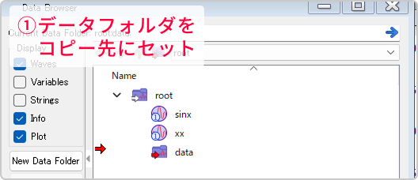

### 複製コマンドを使う

---

- **Duplicate操作関数**
    
    ```igor
        Duplicate [flags][type flags] srcWaveName, destWaveName [, destWaveName]…
    ```

    同一データフォルダ内、別のデータフォルダ内（パスの指定が必要）のどちらでも対応できる。
    
    | **代表的なフラグ** | **効果** |
    | --- | --- |
    | /O | 既存Waveを上書き |
    | /R[startP, endP] | 行範囲を指定して複製 |
    | /R(startX, endX) | X範囲を指定して複製 |
    
    その他のフラグ、より詳細な使い方はマニュアル参照。
    

### 別のデータフォルダに複製

---

- **手法その①：シンプル**
    
    Ctrl（command）を押さないと移動になります。
    
    
    
- **手法その②：テーブルを活用**
  
  1. 現在のデータフォルダをコピー先に設定する。
   
     
     
  2. コピーしたいwaveをすべて選択→ダブルクリックでテーブルとして表示する。  
     テーブル表示したwaveの列タイトルを押して全選択し、コピー。
  3. テーブルの空白部分をクリックし、コピーしたwaveをペースト。
   
     

  4. ペースト時に自動的にセットしたデータフォルダにwaveがコピーされる。
   
     


    ただし、行数の異なるwaveは、テーブル上で一括で選択できないので別途コピーペーストを行う必要があります。

---

- **関連リンク**

    <div class="related-link-wrapper">
      [modal-2]<!--Waveの作成（Make, Duplicate）--><br>
      [modal-3]<!--データフォルダの複製（DuplicateDataFolder）-->
    </div>