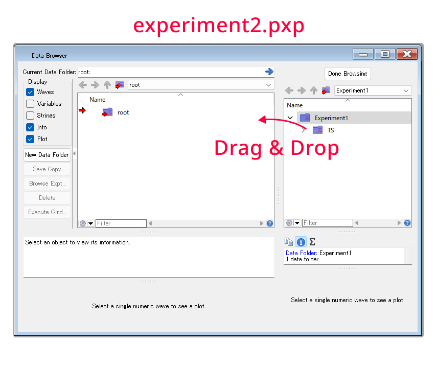

# はじめに

---

Igorでより効率的に作業を行うために、筆者がよく用いていた手法をまとめました。

※あくまで当サイトの管理人独自のやり方ですので、もっと良い方法があるかもしれません。

# オートセーブ

---

1. 上部の「Miscellaneous Setting<span></span>」から「Autosave」を選択。
2. 「Run Autosave Every `…` Minutes」のチェックボックスをチェックする。
`…`に入れる数字はオートセーブの間隔（分）です。

オートセーブは以下の2つのモードがあります。

- **Indirect Mode：** オートセーブがかかると、拡張子が.autosaveファイルが生成される。編集中のpxp自体は上書きされない。
- **Direct Mode：** pxp自体が上書きされる。

Indirect Modeだと、次回開いたときにオートセーブしたファイルとセーブ前のファイルのどちらを開くか確認してくれるのでオススメです。


# グラフのスタイルを保存

---

1. グラフを選択した状態で、上部のメニューからGraph>Capture Graph Preferencesを選択。
2. キャプチャしたいやつにチェックを入れて保存できます。  
例：「XY Plots: Axis and Axis Label」をチェックすると、軸と軸のラベルの設定が保存され、次回以降同じ設定のグラフが出力されるようになります。


# Window Browserの活用

---


- 「Window Browser<span></span>」でグラフなどを管理すると便利です。
- しばらく使わないグラフは、目玉のマークを押して非表示にしておくと起動が早くなります。

# Window macro、Style macro

---

- グラフのスタイルをほかのグラフに適用したいときは、Style macroが便利です。
    - WinならCtrl+Y、Macならcommand+Yでダイアログを開き、Style macroを作成。
    - 適用させたいスタイル(例：プロットの色)の記述以外を消し、適用させたいグラフをアクティブにする。
    - コマンドウィンドウにマクロ名を打ち込んでEnterする。
- 別のIgorファイルに同じグラフを作りたいときは、Window macroを活用します。
  詳細は次の項目の<span class="inlink">[別のigorファイルからwaveやグラフを読み込む](#header-5)</span>にて。

# 別のIgorファイルからwaveやグラフを読み込む

---

experiment1.pxpの上のwaveをexperiment2.pxpに移動するには、「Browse Expt…」を使うと便利です。


1. 上部メニューの「Start Another Igor Pro Instance<span></span>」、あるいはFile>Start Another Igor Pro Instanceを押す。
   2つのIgorが起動したら、次の図のようにexperiment1.pxpとexperiment2.pxpを同時に表示しておくと良いです。
   
   

2. まず、移行したい側のIgorファイル（experiment2.pxp）に、wave等を読み込ませる必要があります。  
   以下のように、experiment2.pxpで、データブラウザの<span class="wrap-btn-style">Browse Expt…</span>を選択。
   
   

3. ダイアログが出るので、experiment1.pxpを選択して読み込む。
   waveやデータフォルダをドラッグ&ドロップで、experiment2.pxpに取り込めます。

    
    
4. 次に、experiment1.pxpと同じグラフを表示してみます。  
   experiment1.pxpで、目的のグラフをアクティブにし、「Ctrl+Y(Winの場合)」または「command+Y(Macの場合)」でダイアログを開く。

   

5. 「Create Window Macro」を選択してDo Itを押す。
6. 
   
    
7. experiment1.pxpで、「Ctrl+M(Winの場合)」または「command+M(Macの場合)」を押してProcedure Windowを表示する。
    上記で作成したWindow Macroの記述が作成されているので、これをコピーする。
    

8. experiment2.pxpに移り、先程コピーしたマクロをペーストする。
   同様にProcedureを表示して張り付けるだけでよいです。
9. experiment2.pxpでマクロ名をコピー。  

    

10. コマンドウィンドウにマクロ名をペーストしてEnter。
    コマンドウィンドウがない場合はCtrl+J(Winの場合)」または「command+J(Macの場合)」で表示できます。

    

11. なお、エラーする場合は、データフォルダのパスを確認してください。以下のような記述の部分です。
    ```Igor
    SetDataFolder root:xxx
    ```
    experiment1.pxpとexperiment2.pxpで、データフォルダのrootから数えたディレクトリ構造が違う場合、上記の記述だけは書き換える必要があります。    

12. experiment2.pxp上にグラフが表示されます。
    
    簡単なのでぜひお試しあれ。

# 複数のwaveに同じコマンドを打つ「Execute Cmd…」

---


例として、`root:rho:` の中にある`10deg`~`80deg`までのグラフを、右の`graph1_1`に一括でAppendToGrapしたい場合を考えます。

1. `10deg`~`80deg`をすべて選択した状態で、右側の<span class="wrap-btn-style">Execute Cmd…</span>を押す。  
※Shiftを押しながら選択で隣接選択。または、Ctrl(Win)あるいはCommand(Mac)を押しながら選択で非隣接選択。
1. ダイアログが現れる。今回は、複数のwaveの温度依存性を既存のグラフに追加するので、`AppendToGraph %s vs Tempall` とする。  
ここで、`%s` というのが「今選択されているwave」を指す。これらすべてに同様のコマンドを適用するという意味。
    
    

    
3. OKを押すと全waveが追加される。※スタイルは適用されないです。
    

    

<aside class="bulb">
  <div>
  複雑な解析を一気にやりたい場合はMacroを組んだ方が楽だし正確です。
  例で挙げたように、AppendToGraphとか、Macroを書くほどじゃないかなっていう操作にはいいかもしれない。
  </div>
</aside>

- **同じグラフ内のスタイルを一括で変更したい場合：**  
  グラフ上で「Shiftを押しながら」右クリックすると、通常の右クリックメニューが全部のwaveに適用されるようになります。


# 困ったときは…

---

- 公式マニュアルを見よう！
- Help > Igor help Browserもヘルプがみられますし、pdfのマニュアルもあります。
- Igorを使ってたくさん遊ぼう！