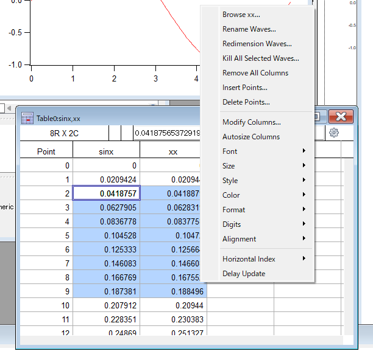

# はじめに
---

ここでは、Igorの操作画面やメニューの説明をざっくり説明します。

Igorでの操作にまだ慣れていない人向けの内容になっていると思います。

詳細は省いて書いているので、自分で色々操作して覚えていくとよいと思います。

# 画面構成
---


| **名称** | **説明** | **備考** |
| --- | --- | --- |
| **データブラウザ** | waveなどのデータを一括管理 | Ctrl+B（Win） / Command+B（Mac） |
| **コマンドウィンドウ** | コマンド実行 | Ctrl+J（Win） / Command+J（Mac） |
| **グラフウィンドウ** | グラフ | - |
| **テーブルウィンドウ** | テーブル | - |
| **レイアウトウィンドウ** | レイアウト | 表示中のウィンドウ（グラフ、テーブルなど）を配置できる |
| **ウィンドウブラウザ** | ウィンドウを管理・整理 | 「Windows > Window Brower」から表示可能 |
| **プロシージャウィンドウ** | MacroやFunctionの記述 | ループ処理や条件分岐の実装に。 |

# 上部メニュー
---


※Macでは若干見た目が違います。

| **名称** | **説明** | **できることの例** |
| --- | --- | --- |
| **①File** | ファイル操作 | {::nomarkdown}<ul><li>エクスペリメントの作成・開閉・保存</li><li>画像の保存</li></ul>{:/nomarkdown} |
| **②Edit** | 編集操作 | {::nomarkdown}<ul><li>コピーやペースト</li><li>グラフをクリップボードに保存</li></ul>{:/nomarkdown} |
| **③Data** | データ操作 | {::nomarkdown}<ul><li>データのロード</li><li>wave作成やポイント数操作</li></ul>{:/nomarkdown} |
| **④Analysis** | データ解析 | {::nomarkdown}<ul><li>fitting</li><li>微分積分</li><li>内挿</li><li>ソート</li></ul>{:/nomarkdown} |
| **⑤Statistics** | 統計解析 | {::nomarkdown}<ul><li>組み込み関数を用いた解析</li></ul>{:/nomarkdown} |
| **⑥Macros** | マクロ | {::nomarkdown}<ul><li>Procedureで書いたマクロが呼び出せる</li></ul>{:/nomarkdown} |
| **⑦Windows** | ウィンドウ操作 | {::nomarkdown}<ul><li>グラフやテーブルなどを新規作成</li><li>ウィンドウブラウザ</li></ul>{:/nomarkdown} |
| **⑧Graph ほか** | そのときアクティブなウィンドウの操作 | {::nomarkdown}<ul><li>Graph, Table, Layout, Procedure 他</li><li>たとえばGraphなら、見た目変更や書式保存など</li></ul>{:/nomarkdown}  |
| **⑨Misc** | 雑多メニュー | {::nomarkdown}<ul><li>デフォルトフォント変更</li></ul>{:/nomarkdown} |
| **⑩Help** | ヘルプ、マニュアル | {::nomarkdown}<ul><li>ヘルプブラウザ</li><li>バージョン情報</li></ul>{:/nomarkdown} |

<aside class="star">
  <div>
  なお、⑪のメニュー下部のツールバーの説明は：<span class="inlink">[Show Toolbar / Hide Toolbar](#header-37)</span>
  </div>
</aside>

## File

### **New Experiment （Ctrl + N / command + N）**

- 新しいエクスペリメントを作成。エクスペリメントとは、要はひとつのプロジェクトを指します。

### **Open Experiment （Ctrl + O / command + O）**

- 既存のエクスペリメントを開く。

### **Save Experiment （Ctrl + S / command + S）**

- セーブです。
- オートセーブの設定をしておくとよいです。ツールバーの「Miscellaneous Setting」（⚙マーク）から、一番上のAutosaveを選び、たとえば以下のように設定しておきます。
    

    

### **Save Experiment As…**

- 「名前を付けて保存」です。

### **Save Experiment Copy…**

- 「コピーを保存」です。

### **Save Graphics…**

- グラフやレイアウトを画像として保存できます。
- svgで保存しておくとあとからイラレ等で編集できて便利。

### **Start Another Igor Pro Instance**

- 2つ以上のIgorを同時に起動できます。

### **Recent Experiments**

- 最近開いたエクスペリメントを開くことができます。

### **Recent Files**

- 最近開いたデータを開くことができます。

## Edit

### **Cut / Copy / Paste**

- 一般的なショートカットが使えます。
  - カット（Ctrl + X / command + X）
  - コピー（Ctrl + C / command + C）
  - ペースト（Ctrl + V / command + V）

### **Duplicate Graph（Ctrl+D / command+D）**

- グラフを複製します。ショートカットをとてもよく使います。

### **Export Graphic**

- グラフをクリップボードに保存できます。
- ただし、pngやsvgの貼り付け先は限定的です（パワポには貼れますがイラレには貼れません）。イラレ等で使いたい場合は「File>Save Graphic」する。

## Data

### **Load Waves**

- 外部からテキストデータをロードします。
- 外部データはエクスプローラーなどからドラッグでも読み込むことができ、こちらもよく使います。
- 「Load General Text…」や「Load Delimited Text…」で、データをwaveとして読み込むことができます。

### **Make Waves**

- ウェーブを作成できます。普段使いはコマンドの方が速いです。

<aside class="">
  <div>
  `Make [flags] waveName`
  <hr>
  **flags** 
  
  - `/O`: 同名のwaveを上書き。
  - `/D`: 倍精度のwaveを作成。
  - `/N=n`: n行のwaveを作成。
  
  **例**
  
  ```Igor
  Make/O/D/N=300 wave1 //300個（0~299）のwaveを作成
  ```
  
  ※その他のFlagはマニュアル参照。
  </div>
</aside>
    

### **Duplicate Waves…**

- waveを複製できます。同じ行数のwaveを作りたいときに重宝します。
- 普段使いはコマンドの方が速いです。

<aside class="">
  <div>
  `Duplicate [flags] srcWaveName, destWaveName [, destWaveName, …]`
  <hr>
  **flags** 
  
  - `/O`: 同名の`destWaveName`を上書き。
  - `/R=[startP,endP]` startPからendPまでの行を複製。
  
  **例**
  
  ```Igor
    Duplicate/O wave1, wave2
    Duplicate/O/R=[30,40] wave1, wave2 //wave1の30行目から40行目までをwave2に複製
  ```
  
  ※その他のFlagはマニュアル参照。
  </div>
</aside>

- 別のデータフォルダにwaveをコピーする場合は、Ctrlまたはcommandを押しながらコピーしたいwaveを目的のデータフォルダにドラッグすると複製できます。

### **Insert Points… / Delete Points…**

- waveに点を追加／削除できます。Table上で右クリックしてやった方が速いです。マクロ書くときのために覚えておくとよいです。
    
 
    

### **Kill Waves…**

- waveを完全に削除します。普段はDeleteで事足りるので、使うのはマクロ組むときかも。

<aside class="">
  <div>
  `KillWaves [flags] WaveName [, WaveName, …]`
  <hr>
  **flags** 
  
  - `/A` 現在のデータフォルダ内の全waveを削除。このときはWaveNameを書かない。
  - `/Z` killするwaveが使用中または存在しない場合にエラーを吐かないようにする。
  - 
  **例**
  
  ```Igor
  KillWaves wave1, wave2 //wave1とwave2を削除
  ```
  
  ※その他のFlagはマニュアル参照。
  </div>
</aside>


### **Rename…**

- waveの名前変更。ここから使うことは少ない。これもマクロとかで使う。
- データブラウザ上で、名前を変更したいwaveを選んで1回クリックすると簡単に名前変更できる。

### **Data Browser（Ctrl+B / command + B）**

- データブラウザを表示。デフォルトで出しとくとよい。

## Analysis

### Curve Fitting…

- さまざまな関数のフィッティングができます。関数は自作も可能。
- 「Function and Data > Function」で関数とwave選択→「Data Options>Range」でフィッティング範囲選択→「Output option」で細かな設定をしてフィッティングします。
- グラフ上のフィッティング範囲の上限下限の位置にカーソルを置いておくと、「Data Options>Range」でカーソルから指定できます。
- 細かいオプションはマニュアル参照。

### Differentiate… / Integrate…

- waveを選んで微分／積分します。
- 細かいオプションはマニュアル参照。

### Interpolate…

- waveを選んで内挿を行います。
- 内挿のコマンドとしては`interp(x1, xWaveName, yWaveName)`というのもあります。
こちらは、`xWaveName`と`yWaveName`という対応している2つのwaveがあったとき、`xWaveName`が`x = x1`となるときのy値を線形補完によって返します。
- 詳しくはマニュアル参照（マニュアルの方がわかりやすいので）。

### Sort…


- 特定のwaveを基準としてwaveをソートします。
  - 例えば、0 Tから-6 Tまでの磁場のwaveを基準として、磁場と電場のwaveを逆順に（つまり-6 Tから0 Tの順に）並べたいとかいうときに使えます。

## Windows

### New Graph…

- 新規グラフを作成します。
- コマンドで`Display yWaveName, xWaveName`としてもよいです。

### New Table…

- 新規テーブルを作成します。

### New Layout…

- レイアウトを作成します。
- レイアウトは、複数のグラフを一括でsvgに出力したりするのに重宝します。

### New…

- Notebook / Panel / Procedureを作成するメニューや、その他の特殊なグラフを作成するメニューが隠れています。
- Notebookはメモ帳として、Procedureはマクロを組むときに使います。Panelはかなりオタク向けのコンテンツですが、極めると楽しい。

### Command Window （Ctrl + J / command + J）

- コマンドウィンドウを表示します。基本的に常駐しておくのがよいです。

### Window Browser

- ウィンドウ（グラフ、テーブル、レイアウト）の表示・非表示を一括管理できます。非常に便利です。
- 消すほどではないけど一旦しまっておきたいウィンドウは非表示にしておくとよいです。
- 詳しくは：<span class="inlink">[ウィンドウブラウザ](#header-75)</span>


### Show Toolbar / Hide Toolbar


- ツールバー（以下）の表示／非表示ができます。
    
    

- 上部メニュー内のいくつかの操作はツールバーからもできます。
- ツールバーからのみ操作できるものとして、「Retrieve Window」および「Retrieve All Windows」があります。
これらは、画面から見切れてしまったウィンドウ（グラフ、レイアウト、テーブル、プロシージャ、○○ブラウザ等のすべて）を画面内に収まるように移動させることができます。

## Graph

- いくつかのメニューは、グラフ上のトレース（=グラフ上にプロットされたデータ）がない位置で右クリックして出したメニュー（下図）と一緒です。
- 基本的には、グラフ上で右クリックして色々いじることの方が多いです。


### Append Traces to Graph…

- 既存のグラフに新しいトレースを追加します。コマンドは`AppendToGraph yWaveName, xWaveName`

### Remove from Graph…

- グラフから特定のデータを選んで除けます。

### Modify Graph…

- グラフの余白やサイズを調整できます。
- グラフのデータ範囲の外側をダブルクリックして編集できるので、メニューから編集することは多くないです。
- 詳しくは：<span class="inlink">[Modify Graph](#header-70)</span>

### Modify Trace Appearance…

- トレースの見た目（色、スタイルなど）を変更できます。
- グラフのデータ範囲内をダブルクリックして編集できるので、メニューから編集することは多くないです。
- 詳しくは：<span class="inlink">[Modify Trace Appearance](#header-69)</span>
### Set Axis Range… / Autoscale Axes / Label Axis… / Modify Axis…

- 軸周りの設定です。
- グラフの軸の上をダブルクリックして編集できるので、メニューから編集することは多くないです。
- 詳しくは：<span class="inlink">[Modify Axis](#header-62)</span>

### Add Annotation…

- 凡例などを追加できます。グラフ右クリックからの方が楽。
- 凡例は「Frame」タブ内で枠線で囲むかを指定したり、背景を城にするか透明にするか選べたりします。

### Show Info （Ctrl + I / command + I）

- カーソルメニューの表示／非表示を切り替えます。
- カーソルはトレース上に最大2つまで置け、その場所の(x, y)値がわかります。
- 下部メニューで右クリックすると細かい設定もできます。
   

    

### Show Tools （Ctrl + T / command + T）

- ツールメニューの表示／非表示を切り替えます。
- ツールメニューを使うとグラフ上に色んなお絵描きができます。
- ツールアイコンは長押しすると細かいメニューが出せます。例えばベジェ曲線とかは使えるようになるとちょっと面白い。


### Capture Graph Prefs…

- グラフの書式を保存できます。設定しておくのが非常に重要です。
- グラフのサイズや色、マーカーなどを設定したのち、必要な項目をCaptureすれば、次回からはDisplayしたときに同じ書式でグラフを表示できます。

### Packages

- グラフ関連のさまざまなパッケージ。特に「Make Traces Different」はとても便利。いろいろ試してみると楽しいかも。

{::nomarkdown}
<aside class="star">
  <div>
{:/nomarkdown}

- テーブルやレイアウト、プロシージャなどをアクティブにしているときのメニューについては、自分で色々試してみてください。
- 例えばLayoutは、「Page Size...」でサイズ変更できます。

{::nomarkdown}
  </div>
</aside>
{:/nomarkdown}

## Misc

### Default font…

- デフォルトフォントを変更できます。
- 個別のフォントを設定しているグラフ等は変化しませんが、デフォルトに設定しているものは一括でフォントが変更されます。

### Graph Browser

- グラフの一覧がみられます。
- ウィンドウブラウザの方が使いやすいかも？

## Help

### Igor Help Browser

- ヘルプがみられます。
- コマンド名がわかっているときに使い方のヘルプを見るには、コマンドウィンドウにコマンドを打って右クリック→Help for ○○から。

# データブラウザ
---


**①Display**

データブラウザ上に表示するデータをフィルタする機能。

**②New Data Folder**

データフォルダを新規作成します。以下コマンドでも可。


<aside class="">
  <div>
  `NewDataFolder [flags] dataFolderSpec`
  <hr>
  **flags** 
  
  - `/O` 同名のデータフォルダを上書き。
  - `/S` データフォルダ作成後、現在のデータフォルダを`dataFolderSpec`に設定する。
  
  **例**
  
  ```Igor
    NewDataFolder/O foo //fooという名前のデータフォルダを作成。既にある場合は上書き。
  ```
  
  ※その他のFlagはマニュアル参照。
  </div>
</aside>

**③Save copy**

選択中のデータをすべて格納した新しいIgorファイル（.pxp）を作成します。

**④Browse Expt…**

別のIgorファイル（.pxp）内のデータを参照します。

**⑤Delete**

選択中のデータを削除します。
「Alt」（win）あるいは「option」（Mac）を押しながらDeleteを押すと、確認ダイアログなしで消せます。

**⑥Execute Cmd…**

選択中のデータに同じコマンドを適用できます。
同じグラフに複数のwaveをプロットするときなどに簡易的に使えます。

**⑦データフォルダ**

左側の赤い矢印が「現在いるフォルダ」を表します。

フォルダを移動する方法は次の3通り。

1. 赤い矢印をドラッグして移動させる。
2. Alt（Win）またはoption（mac）を押しながら移動先フォルダをクリック。
3. 移動したいフォルダの上で左クリック>「Set Current Data Folder」をする。

**⑧ウェーブ**

**⑨ウェーブの詳細**

Infoをチェックすると表示されます。

右上の鉛筆マークでNoteを編集できます。Noteコマンドでも可。

**⑩簡易プロット**

plotをチェックすると表示されます。

# コマンドウィンドウ

---

- 上下の矢印キーで以前のコマンドを選択できます。
- 履歴からコマンドラインに行をコピーするには、
    - 行をクリックしてEnterを押す（一部選択の状態でも可）。
    - 「Alt」または「option」を押しながら行をクリック。
- コマンドラインの中でテキスト検索するには、「Ctrl+F」または「command+F」
- コマンドラインで簡単な数値計算をするには`print` コマンドで。

# グラフ
---

グラフでは、グラフ上のどこをダブルクリック／右クリックするかで、開くメニューがそれぞれ異なります。
上部メニューについては、<span class="inlink">[Graph](#header-38)</span> も参照。


**ダブルクリック時**

①：<span class="inlink">[Modify Axis](#header-62)</span>

②③：<span class="inlink">[Modify Trace Appearance](#header-69)</span>

④：<span class="inlink">[Modify Axis](#header-62)</span>

**右クリック時**

①②④：グラフメニュー

③：トレースメニュー（Shiftを押しながらだと全部のトレースを一括で変更可能）

## Modify Axis

### Axis

- Mode
    - スケールの選択ができます（linear, log, log2など）。
- Axis
    - Standoffのチェックを外す。軸の両端の処理のため。
    - MirrorはOnにする（左右の軸が異なる場合を除く）。

### Auto/Man Ticks

- Auto Tick
    - 目盛りをオートで振ります。
- Computed Manual Ticks
    - Major Ticksで長い目盛り、Minor Ticksで短い目盛りの間隔を指定。
- UserTicks from Waves
    - waveから目盛りを選択できます。

### Ticks and Grids

- Tick Dimensions
    - LocationをInsideにする。内向きの目盛りになります。
    - Major、Minor目盛りの長さ（Length）などを指定できます。7 : 3くらいがバランスが良くておすすめ！
    
    
    
- Grid
    - グリッドを表示、カスタムできます。
- Zero Line
    - ゼロの線を描画、カスタムできます。

### Axis Label

- 軸ラベルを設定できます。
- Insertから色んな表式のコマンドが出せますが、コマンドを覚えたら打ち込む方が速いです。例えば、斜体にするには`\f02` とします。

### Label Options

- Label
    - オンオフを切り替えられます。
- Label Position Mode
    - ラベルの配置に関するモードを指定。
- Axis label margin
    - ラベルと軸の間の余白を数値で調整できます。

### Axis Range

- Manual Range Settings
    - プロットの範囲を指定できます。

## Modify Trace Appearance

トレースのスタイルを変更できます。

ShiftやCtrl/commandを押しながら選択で複数選択できます。

- Color
    - 色の変更ができます。
    - 白背景のプレゼンでは、明度の高い色と蛍光色を避けた方がよいです（以下の斜線部）。
    特に黄～緑は見えないのでなるべく避ける。
    - Other…を押すと好きな色に設定できます。
    
    
- Hide Trace
    - トレースの表示／非表示を切り替えられます。
- Mode
    - マーカーを変えられます。
    - プレゼンでは、マーカーが小さかったり線が細いと見えにくいです。マーカーサイズ、太さ、および線の太さを適切に。
    - マーカーの場合、Fill colorで中身の色を指定できます。
    - ラインの場合、styleで線のスタイルを変更できます。
    - f(z)でwaveを選ぶと重みづけも可能です。
    - バーグラフ等も作れます。その他については色々試してみてください。
- Error Bars
    - エラーバーを設定できます。
- Offset
    - オフセットを変更できます。

## Modify Graph

### Margins

- 余白の設定。数値で書くかAutoで指定できます。

### Width mode / Height mode

- グラフの縦横のサイズを指定できます。
    - Auto: オート指定。
    - Absolute: 絶対値指定。
    - perUnit: 軸の単位で指定。
    - Aspect: アス比で指定。
    - Plan: 細かい設定。

### Marker size / Font size

- Modify Trace AppearanceでこれらのパラメータをAutoにしている場合、ここで指定した値が使われる。
- すべてのトレースで同じサイズのフォントやマーカーを使う場合は、こっちで指定するのがオススメ。後で変えたくなったときに少し楽です。


# テーブル
---
上部メニューについては、<span class="inlink">[Table](#header-49)</span> も参照。


- 外部の区切りデータをテキストでコピーペースト可能です。
- 表の行タイトルや列タイトルを選ぶと、その行および列を全選択可能です。
- 点を消したい／増やしたいところで右クリック>Insert PointsまたはDelete Pointsが使えます。
- テーブルから消したい列は、列選択後右クリック>Remove WaveName


# レイアウト
---
上部メニューについては、<span class="inlink">[Layout](#header-50)</span> も参照。


- 作成しているグラフをレイアウトに追加できます。
- レイアウトサイズを変えるときは、レイアウトをアクティブにした状態で上部メニューの「Page Size…」を押します。
- 点を消したい／増やしたいところで右クリック>Insert PointsまたはDelete Pointsが使えます。
- テーブルから消したい列は、列選択後右クリック>Remove WaveName

# ウィンドウブラウザ
---
<span class="inlink">[Window Browser](#header-36)</span>に書いたように、上部メニューから呼び出せます。


- ①②：ウィンドウの表示、非表示ができます。
- ③④：ウィンドウの表示の前後を換えられます。
- ⑤⑥：画面外に見切れたグラフを画面内に移動できます。
- ⑦：ウィンドウブラウザにリストするウィンドウを指定します。

