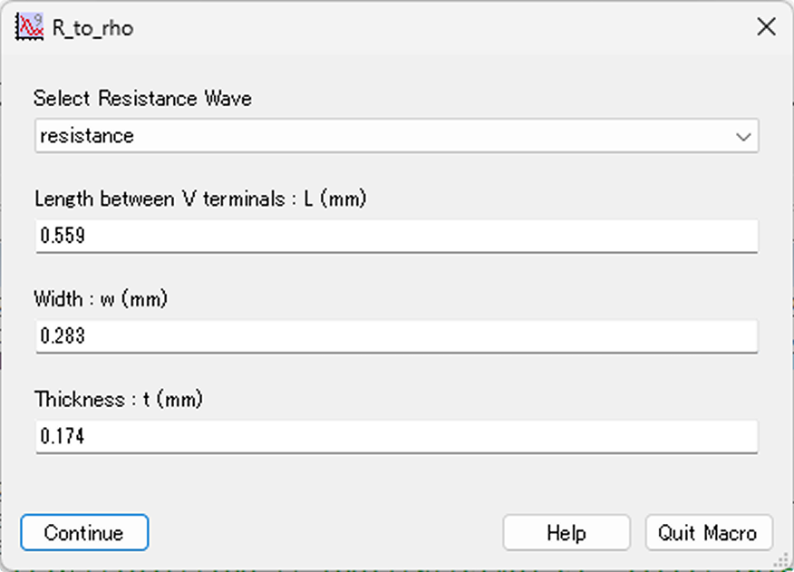
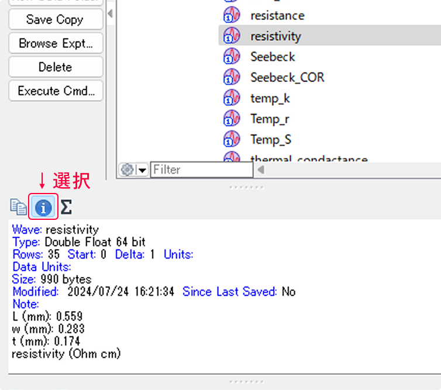
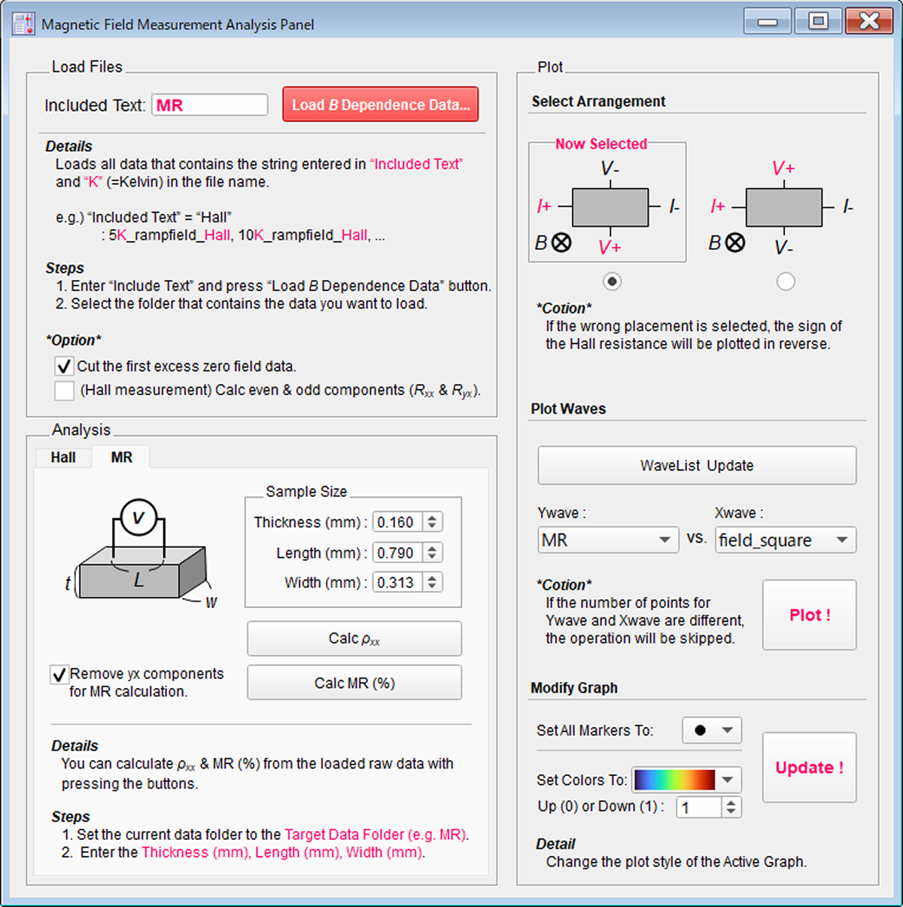

少しだけですが、いくつかプロシージャを置いておきます。

# マクロの配置場所

---

- 複数のigorファイルで同じマクロを使い回す場合、`C:\Users\Documents\WaveMetrics\Igor Pro 9 User Files\Igor Procedures` の下に.ipfという拡張子でマクロを保存する。
- 1つのpxpファイルの中でしか使わないなら、Igor上でCtrl+Mを押して出てくるprosedureの中に書き込んでもOK。

# **マクロ倉庫**

---

ここに置いたのは一例です。Igorマニュアルを参考に、自分でも色々作ってみると面白いです。

## 1. データ読み込み時の名前付け自動化


{::nomarkdown}
<details  class= "details" markdown="1">
    <summary class="summary">
    <span class="summary-inner">
    コピペ用コード（トグルで開く）
    
    </span>
    </summary>
    <div class="details-content">
    <div class="details-content-inner">
{:/nomarkdown}

```Igor
Menu "Load Waves" // メニューに「Load Waves」を追加
	"Load S Data File...", LoadSdata()
End

Proc LoadSdata()

     // データファイル読み込み
	Variable refNum
	String message="Select S data file"
	String fileFilters = "Data Files (*.txt,*.dat,*.csv):.txt,.dat,.csv;"
	fileFilters += "All Files:.*;"

		Open/R/M=message  refNum as ""
		if (refNum == 0)
			return -1
		endif
		String fullPath = S_fileName
		Close refNum

	LoadWave/J/D/W/A/K=0 fullPath

    // リネーム
	rename wave0, time__s; rename wave1, Temp1__K;
    rename wave2, V_L1_man__V; rename wave3, V_H1_con__V;
	rename wave4, Temp2__K; rename wave5, V_L2_man__V;
    rename wave6, V_H2_con__V; rename wave7, Delta_V__V;
	rename wave8, Delta_T__K; rename wave9, avg_T__K;
    rename wave10, V_s3__V; rename wave11, V_s4__V;
	rename wave12, V_s5__V; rename wave13, data_for_monitoring1;
    rename wave14, data_for_monitoring2

End
```

{::nomarkdown}
  </div>
  </div>
</details>
{:/nomarkdown}


- Seebeck係数測定プログラムのデータを読み込むために作りました。
    1. 上記の「マクロの配置場所」を参考に、本項目末尾のLoad_S_rawdata.ipfを配置。
    2. コマンドラインに`LoadSdata()`と入力。        
    3. 右下で拡張子をdataファイルを「All Files (\*,\*)」にし、データファイルを選択。
        
        
        
    4. wave名のついたデータが読み込まれる。
    5. プログラムは、「rename…」以下の部分を適宜変更してください。


詳細は：<span class="familylink">[データの名前付け自動化 -マクロを書こう③-](../Igor-macro/Igor-macro-archive.html)</span>へ。


## 2. 電気抵抗$R$→電気抵抗率$\rho$


{::nomarkdown}
<details  class= "details" markdown="1">
    <summary class="summary">
    <span class="summary-inner">
    コピペ用コード（トグルで開く）
    
    </span>
    </summary>
    <div class="details-content">
    <div class="details-content-inner">
{:/nomarkdown}

```Igor
macro R_to_rho(Res,ll,ww,tt) 

 string Res
 prompt Res,"Select Resistance Wave",popup,wavelist("*",";","")
 
 variable ll,tt,ww
 prompt ll,"Length between V terminals : L (mm)"
 prompt ww,"Width : w (mm)"
 prompt tt,"Thickness : t (mm)"
 
 Dup_R(Res,ll,ww,tt)

endmacro

function Dup_R(Res,ll,ww,tt)

 string Res 
 
 variable ll,tt,ww
  
 Note/K $(Res) //remove existing note
 Note $(Res), "Length between V terminals : L (mm): "+num2str(ll)
 Note $(Res), "Width : w (mm): "+num2str(ww)
 Note $(Res), "Thickness : t (mm): "+num2str(tt) 
 
 duplicate/O $(Res), resistivity
 duplicate/O $(Res), Rdummy
 
 resistivity=10^(-1)*Rdummy*(tt*ww)/ll
 killwaves Rdummy
 
 Note resistivity, "resistivity (Ohm cm)"
 
end
```

{::nomarkdown}
  </div>
  </div>
</details>
{:/nomarkdown}


1. あらかじめ、電気抵抗のwaveがあるディレクトリに移動しておく。
2. コマンドラインに`R_to_rho()`と入力。
3. 「Select Resistance Wave」と書かれたプルダウンリストから電気抵抗のwaveを選び、電圧端子間距離$L$、試料の幅$$w$、厚み$t$を入力（単位はmm）。
    
    
    
4. resistivityのwaveが作成される（単位はΩ cm。必要に応じて書き換えてください）。Noteには入力した試料サイズの情報が書き込まれる。
    
    

---

## 3. [無冷媒マグネット]　ホール／MR測定パネルマクロ
ホール／MR測定の解析を行うためのパネルマクロです。

「temp_field_control_Hall_MR.vi」というLabViewプログラムに対応するように作っていますが、要件を満たすviなら何でも対応します。

解析の機能がやや中途半端なので、好きに書き換えて使ってください。


### ダウンロード

以下からダウンロードして使えます。


{::nomarkdown}
<div class="iframely-embed  not-select">
    <a href="https://github.com/YLCPNPSEGTDHETYL/Igor-magnet-panel/blob/main/MagMeasAnalysis.ipf" data-iframely-url="//cdn.iframe.ly/api/iframe?url=https%3A%2F%2Fgithub.com%2FYLCPNPSEGTDHETYL%2FIgor-magnet-panel%2Fblob%2Fmain%2FMagMeasAnalysis.ipf&key=94043bf13722791cf83e87024e8939e2"></a>  
</div>
{:/nomarkdown}


### 概要

1. ipfを読み込むと、メニューバーからパネルを起動できます。
2. データの読み取りの自動化・一括解析・一括プロットなどができます。
    
    

### 詳細

- **Load Files**
    - フォルダ内の連番のファイルを一括でigorに読み込みます。
    - 「K」という文字列と、「Include Text」に入力した文字列を両方含むファイルを読み込みます。図では「Hall」が指定されているので、Hallを名前に含むようなファイルが選択的に読み込まれます。
    - オプションで、最初に挿入される余分なゼロ点のカット（Cut the first …）／ホールの偶奇成分の計算（Calc even & odd …）をするか指定できます。
    - 読み込んだ（or 解析した）データの単位は、データブラウザのNoteから確認できます。
        
- **Analysis**
    - HallタブではHall、MRタブではMRの計算が行えます。
    - $\rho_{yx}$ の計算（ホール測定）では厚み、$\rho_{xx}$の計算（MR測定）では厚み、電圧端子間距離、幅の入力が必須です。
    ※MR (%)の計算では、サイズの入力は必須ではありません。
    - MRでは、オプションで$yx$成分を消すかを選択できます。
    「Remove yx …」にチェックした場合、$R_{xx}$、$R_{yx}$の計算を先に行い、ここから得た$R_{xx}$のwaveを用いてMRの計算を行います。
    
- **Plot**
    - **Select Arrangement：**
        - 測定の配置を選択できます。
        ホール抵抗（率）のプロットをする際は、必ず配置を指定してください。
    - **Plot Waves：**
        - 温度の異なる複数のwaveを一括でプロットします。
        「WaveList Update」を押してリストを更新し、プロットしたいYwave、Xwaveを選択してください。
        - `field`, `rho_yx`, `rho_xx`, `resistance`, `Rxx`, `Ryx`, `Temp`, `MR`, `Volt`のいずれかを名称に含むwaveの場合（※大文字と小文字の区別なし）は、グラフのラベルが自動でつきます。
        - `rho_yx`, `Ryx`のいずれかを名称に含むwaveをYwaveに選んだ場合は、**Select Arrangement**で選んだ配置にしたがい、必要に応じて負のオフセットをつけた状態でプロットします。
        - ※「WaveList Update」で取得するのは、「△K_○○」という名称のwaveのみです。
        - ※選んだ名前のwaveがひとつも見つからない場合、およびYwaveとXwaveのデータ点数が異なる場合は、処理が中断されます。
    - **Modify Graph：**
        - グラフのスタイル（色とマーカー）を一括変更します。
        - 色は選んだカラーバーから抽出されます（初期設定はTurbo）。  
          Up to Downは0か1の値をとり、昇順と降順を変えられます（初期設定は1）。
        - マーカーの初期設定は中黒の丸⚫です。