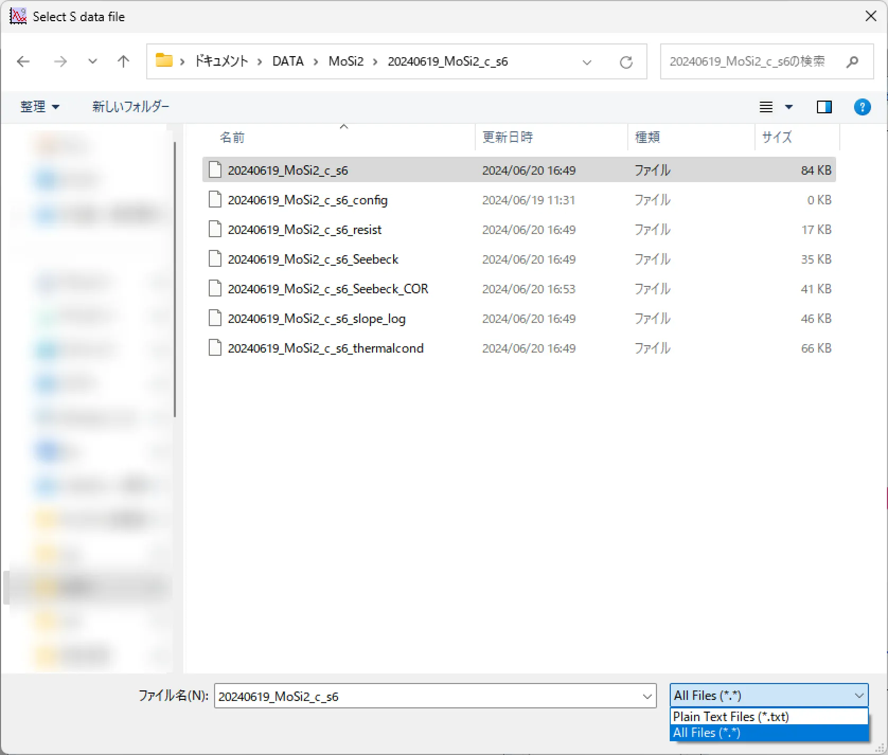

少しだけですが、いくつかプロシージャを置いておきます。

# マクロの配置場所

---

- 複数のigorファイルで同じマクロを使い回す場合、`C:\Users\Documents\WaveMetrics\Igor Pro 9 User Files\Igor Procedures` の下に.ipfという拡張子でマクロを保存する。
- 1つのpxpファイルの中でしか使わないなら、Igor上でCtrl+Mを押して出てくるprosedureの中に書き込んでもOK。

# **マクロ倉庫**

---

ここに置いたのは一例です。Igorマニュアルを参考に、自分でも色々作ってみると面白いです。

## 1. データ読み込み時の名前付け自動化

- Seebeck係数測定プログラムのデータを読み込むために作りました。
    1. 上記の「マクロの配置場所」を参考に、本項目末尾のLoad_S_rawdata.ipfを配置。
    2. 「Command Window」に`LoadSdata()`と入力。        
    3. 右下で拡張子をdataファイルを「All Files (\*,\*)」にし、データファイルを選択。
        
        
        
    4. wave名のついたデータが読み込まれる。
    5. プログラムは、「rename…」以下の部分を適宜変更してください。 

- 詳細は：[マクロを書こう③~データの名前付け自動化~](../Igor-macro/Igor-macro-archive.html)へ。

## 2. 電気抵抗*R*→電気抵抗率*ρ*

1. あらかじめ、電気抵抗のwaveがあるディレクトリに移動しておく。
2. 「Command Window」に`R_to_rho()`と入力。
3. 「Select Resistance Wave」と書かれたプルダウンリストから電気抵抗のwaveを選び、電圧端子間距離L、試料の幅w、厚みtを入力(単位はmm)。
    
    
    
4. resistivityのwaveが作成される(単位はΩ cm。必要に応じて書き換えてください)。Noteには入力した試料サイズの情報が書き込まれる。

---

[電気抵抗→電気抵抗率。](https://prod-files-secure.s3.us-west-2.amazonaws.com/274f8ade-0aaf-45b9-8658-f88c40de1a65/b7ac619d-3fb6-4a90-af3b-f244835556de/R_to_rho.ipf)

電気抵抗→電気抵抗率。

[熱伝導→熱伝導率。](https://prod-files-secure.s3.us-west-2.amazonaws.com/274f8ade-0aaf-45b9-8658-f88c40de1a65/7057071e-3084-49b5-9d71-ed95ad9dfa59/K_to_kappa.ipf)

熱伝導→熱伝導率。

## 3. [無冷媒マグネット]　ホール／MR測定パネルマクロ
ホール／MR測定の解析を行うためのパネルマクロです。  
かなり気合を入れて作りました。  
機能としては中途半端かもしれません。。。もっといろいろできるようにしたかった。

### ダウンロード

[MagMeasAnalysis.ipf](https://prod-files-secure.s3.us-west-2.amazonaws.com/274f8ade-0aaf-45b9-8658-f88c40de1a65/06b852fb-2b2f-4889-9c16-9495c0ecaab2/MagMeasAnalysis.ipf)

### 概要

1. ipfを読み込むと、メニューバーからパネルを起動できます。
2. データの読み取りの自動化・一括解析・一括プロットなどができます。
    
    
    

### 詳細

- **Load Files**
    - フォルダ内の連番のファイルを一括でigorに読み込みます。
    - 「K」という文字列と、「Include Text」に入力した文字列を両方含むファイルを読み込みます。図では「Hall」が指定されているので、Hallを名前に含むようなファイルが選択的に読み込まれます。
    - オプションで、最初に挿入される余分なゼロ点のカット(Cut the first …)／ホールの偶奇成分の計算(Calc even & odd …)をするか指定できます。
    - 読み込んだ(or 解析した)データの単位は、データブラウザのNoteから確認できます(以下参照)。
        
        
        
- **Analysis**
    - HallタブではHall、MRタブではMRの計算が行えます。
    - (Hall) ρyxの計算では厚み、(MR) ρxxの計算では厚み、電圧端子間距離、幅の入力が必須です。
    ※MR (%)の計算では、サイズの入力は必須ではありません。
    - MRでは、オプションでyx成分を消すかを選択できます。
    「Remove yx …」にチェックした場合、Rxx, Ryxの計算を先に行い、ここから得たRxxのwaveを用いてMRの計算を行います。
- **Plot**
    - **Select Arrangement：**
        - 測定の配置を選択できます。
        ホール抵抗(率)のプロットをする際は、必ず配置を指定してください。
    - **Plot Waves：**
        - 温度の異なる複数のwaveを一括でプロットします。
        「WaveList Update」を押してリストを更新し、プロットしたいYwave、Xwaveを選択してください。
        - `field`, `rho_yx`, `rho_xx`, `resistance`, `Rxx`, `Ryx`, `Temp`, `MR`, `Volt`のいずれかを名称に含むwaveの場合(※大文字と小文字の区別なし)は、グラフのラベルが自動でつきます。
        - `rho_yx`, `Ryx`のいずれかを名称に含むwaveをYwaveに選んだ場合は、**Select Arrangement**で選んだ配置にしたがい、必要に応じて負のオフセットをつけた状態でプロットします。
        - ※「WaveList Update」で取得するのは、「△K_○○」という名称のwaveのみです。
        - ※選んだ名前のwaveがひとつも見つからない場合、およびYwaveとXwaveのデータ点数が異なる場合は、処理が中断されます。
    - **Modify Graph：**
        - グラフのスタイル(色とマーカー)を一括変更します。
        - 色は選んだカラーバーから抽出されます(初期設定はTurbo)。Up to Downは0か1の値をとり、昇順と降順を変えられます(初期設定は1)。
        - マーカーの初期設定は中黒の丸⚫です。