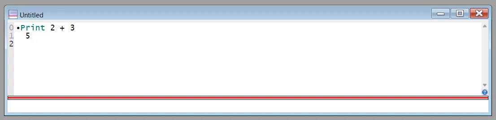
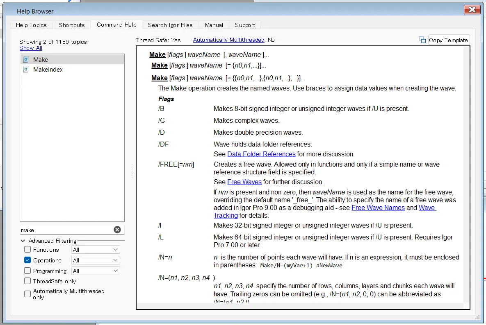
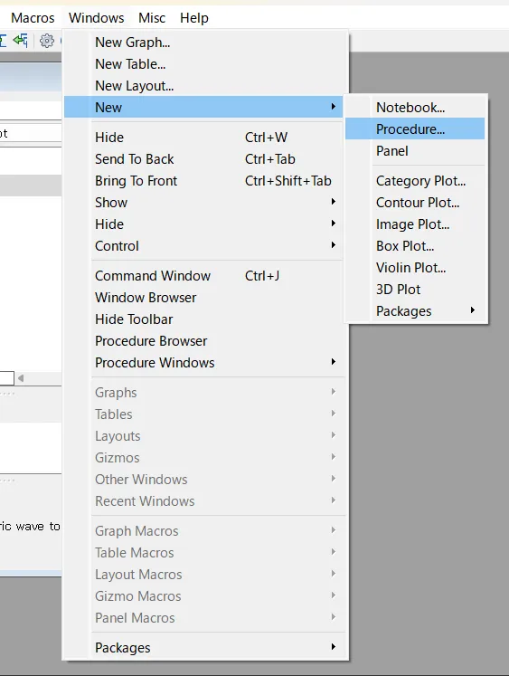

# なんでマクロなの？
---

Igor Proは科学技術計算やデータ解析に優れたソフトウェアです。

UIを操作することで直感的にグラフを作成でき、多くの解析機能も備わっています。

Igorは、UIを操作するだけではなく、コマンドラインでコマンドを打ち込んだり、プロシージャウィンドウでマクロやファンクションを書くこともできます。

特定のデータ処理を自動化すると、作業における人為的なミスがなくなり、効率的に解析を行うことができるようになります。

例えば、以下のような作業がマクロで行えます。

- データのインポートと整理
- 繰り返し計算の自動化
- グラフの作成とレイアウト調整
- ユーザー入力を受け取るインターフェースの構築

本記事では、Igor Proのマクロを書く第一歩となるように、まずはコマンドでの作業を行うやり方について解説します。

# コマンドウィンドウでの基本操作

---

コマンドウィンドウを使ってみましょう。

windowsは「**Ctrl+J**」、Macは「**command+J**」で表示できます。

コマンドウィンドウが表示されたら、以下コマンドを打ってEnterしてみましょう。

```Igor
Print 2 + 3
```


このように、Igorではprintが使えます。簡単な数値計算に使います。

他にも、コマンドウィンドウでは、例えば以下のようなコマンドが使えます。

```Igor
Print sin(0.5) // sin関数の計算
Variable xx = 10 // 変数xxの定義
Print xx * 2 // 変数xxを用いた計算
```

上記のコマンドもコマンドウィンドウで試してみましょう。

2行目を実行したときには、Data Browserに「xx」という名前のvariableが作成されます。

これらができたら、まずはコマンドが使えたことになります。

次からは、もう少し具体的にコマンドの使い方を見ていきます。

# コマンドタイプ

---

コマンドラインから実行可能なコマンドには3つの基本的に異なるタイプがあります。

- 代入文
- 操作関数
- ユーザ定義プロシージャコマンド

以下はその例です。

```Igor
wave1 = wave2 * (1 + 2 * 3^2) // 代入文
Display wave1,wave2 vs xwave // 操作関数
myfunc() // ユーザ定義プロシージャコマンド
```

次からは、それぞれの文についてみていきます。

## 代入文

代入文は、waveまたは変数に値を代入する文です。

最も多く使うのは、waveに値を代入するコマンドだと思います。

```Igor
wave1 = wave2 * (1 + 2 * 3^2) // 代入文
```

この文では、wave1というwaveに値を代入しています。

wave1、wave2というwaveが存在していると、上記のコマンドは正しく実行されます。

代入演算子は、`=` だけではなく`+=` や`*=` なども使えます。

演算子は、加減乗除`+-*/`やべき乗`^` だけではなく、比較演算子や、論理AND`&&` や論理OR`||` 、条件演算子`<expression> ? <TRUE> : <FALSE>` なども使えます（使う機会は少ないかも）。

詳しくはマニュアル参照。

## 操作関数

操作関数は、Igorでの作業の大部分を占めると思います。

例えば、新しいwaveを作成するときは次のようなコマンドを書きます。

```Igor
Make/D/N=300 Wave1, Wave2, Wave3
```

操作関数コマンドの構文は、一般的に操作関数名、フラグ（オプションのリストのこと）に続き、パラメータリストが続くという構成になっています。

上記の場合は

- 操作関数名：「`Make`」
- フラグ：「`/D/N=300`」
- パラメータリスト：「`Wave1, Wave2, Wave3`」

となります。

操作関数の使い方は、Igorの上部メニューで「Help>Igor Help Browser」から検索もできます。

ヘルプブラウザの「Command Help」で、「Make」コマンドを検索してみます。



ヘルプを見ると、例えば次のようなことがわかります。

- `Make [flag] waveName [, waveName]...` の形で記述する。※`[]` は省略可能という意味。
- `flag` は多数存在している。先程の例でいうと、
    - `/D` は、作成するWaveを倍精度にする。
    - `/N=*n*` は、ポイント数が`*n*`のWaveにする。
- パラメータリストは、カンマつなぎで`waveName1, waveName2` のようにすることで、複数のWaveを同時に作成できる。

なお、さまざまな操作関数の使い方は、Igorのpdf版のマニュアルにも書いてあります。

上記で見た`Make`以外にも、便利な操作関数はたくさんあります。

Igor上でグラフや表に対して何らかの操作をしたときに、コマンドウィンドウに勝手に入力されるコマンドがあると思いますが、それらもほとんどが操作関数です。

操作関数をいくつか覚えておくと、コマンドウィンドウだけでほとんどの作業が行えるようにもなります。

## ユーザ定義プロシージャコマンド

ユーザーは、プロシージャを独自に定義して実行することができます。  
これが、一連の処理を自動化するのにつかわれる「マクロ」や「ファンクション」に該当します。  
まず、プロシージャウィンドウを開きましょう。

windowsは「**Ctrl+M**」、Macは「**command+M**」で表示できます。  
あるいは、上部メニューから「Windows>New>Procedure…」とすると、新規プロシージャを作成することもできます。



プロシージャを開いたら、以下のマクロを書いてみましょう。

```Igor
macro myfunc()
	Make/D/N=300 Wave4, Wave5, Wave6	
end
```

ここで、`myfunc()` の部分がユーザ定義プロシージャコマンドのキー名です。

この部分は好き勝手な名前を付けられます。

これができたら、コマンドラインに以下を打ちます。

```Igor
myfunc()
```

すると、関数が実行されて新しいwaveが作成されると思います。

※エラーが出る場合は、すでに同じ名前のwaveがないか？などをチェックしてください。

このように、ユーザ定義プロシージャコマンドには、コマンドラインに直接打ち込む操作関数を含めることができます。

ユーザ定義プロシージャコマンドには、「関数」とよばれるものと、「マクロ」と呼ばれるものがます。

- 「関数」は`Function` から始めます。
- 「マクロ」の構文は、いくつかの種類があります。
    
    
    | **定義キーワード** | **実行内容** |
    | --- | --- |
    | `Macro` | マクロメニューに表示されるマクロを作成。 |
    | `Proc` | メニューに表示されないマクロを作成。 |
    | `Window` | ウィンドウメニューに表示されるマクロを作成。 |

「関数」と「マクロ」は役割が異なり、使えるコマンドも若干異なる部分があります。

「関数」は主に計算を行い、何かの値を返すために用います。

一方、「マクロ」は、一連の処理を順番に実行するスクリプトを書きます。

が、とりあえずはどちらも「自分で定義して使えるコマンド」という認識で大丈夫です。  


ユーザ定義プロシージャコマンドは、上記のように操作関数を実行することもできますが、コマンドラインでは通常行えないような構文も使用できます。  
最も代表的な例としては、条件文（If-Else-EndIf文）やループ（Do-WhileループやForループ）などでしょう。  
Igorのプログラムは、かなりプアな部分も多いですが、それでも基本的な自動化操作を行うには十分な機能が備わっていると思います。  
解析という意味では、簡単な条件文やループ文の書き方をマスターしていれば、そこまで困ることはないと思います。


# コマンドの基礎知識
---

## コメント
コメントは、コマンドラインの実行部分の最後に「`//`」を記述したところから始まり、行の最後まで続きます。  
コマンドラインの中間にコメントを挿入することはできません。  


## 変数型
Igorの変数は、数値変数、文字列変数、ウェーブなどに分けられます。  

| **データ型** | **説明** |
| --- | --- |
| `Variable` | 実数変数または複素数変数。 |
| `String` | 文字列変数。 |
| `Wave` | Wave名を参照するための変数。 |

### 数値変数Variable
数値データを格納する基本的なデータ型です。

```Igor
function varfunc()
    Variable a = 10
    Variable b = 5.5
    Print a + b
end
```


### 文字列変数String
文字列データを格納するためのデータ型です。

```Igor
function strfunc()
    String message = "Hello, Igor!"
    Print message
end
```

### Wave
Waveは数値の配列を扱うためのデータ型で、データ解析やグラフ描画に多用されます。


```Igor
function wavefunc()
	wave w1 = wave1
	wave w2 = wave2
    w1 = w1 + w2
end
```

## データ型の変換


| **説明** | **関数** |
| --- | --- |
| 数値を文字列に変換。 | `num2str(num)` |
| 文字列を数値に変換。 | `str2num(str)` |


次の記事では、これらのユーザ定義プロシージャコマンドの書き方について簡単に紹介します。