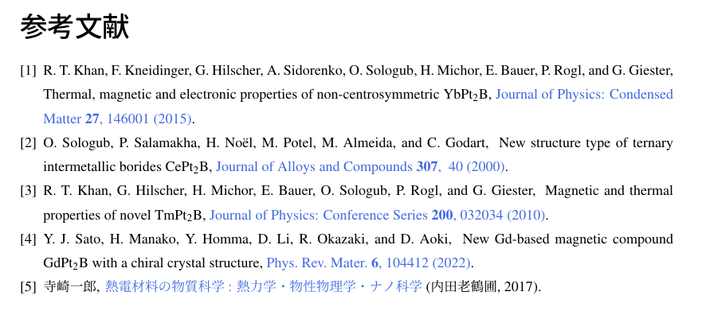

# bibファイルで参考文献を自動作成しよう！

---

卒論・修論みたいに、ページ数の膨大なレポートを書くときに、手打ちでひとつひとつ参考文献を書くのはめちゃ大変(しかも、人為的ミスが起きがち)。
  - 引用した順に並べる、形式を間違えず書く、etc…


**bibファイルを用いることで、この作業を自動化しよう！**　というのが本記事の目的です。


# 事前準備①：bibファイル、bstファイルの準備

---

自動化のためには、拡張子が`.bib`(=bibliography)と、`.bst`(=bibliography style)の2つのファイルが必要です。

bstファイルは、LaTeX標準のものや、各論文誌の形式に沿ったものもありますが、今回は自作のファイルに基づいて説明します。


<aside class="pinned">
<div>
bstファイルの方は、既存の「junsrt.bst」を元にして、一部改変をしています。<br>
非公式のものなので、予期せぬエラーや不具合が生じる場合があります。<br>
不具合報告は6223529＊ed.tus.ac.jpまで(＊→@)。
</div>
</aside>

- bstファイル「REVTeX-ja.bst」(必要ならばbibファイルref.bibも)を、以下からダウンロードします。
    
    <aside class="star">
    <div>
    **bstファイル**
    
    - ~~bstファイルは、ハイパーリンク付き(`hyperref`パッケージが必要)とハイパーリンクなしの2つがあります。~~
    - (2024/10/23)<span class="block-color-red">アップデートにより、ハイパーリンクの有無にかかわらず、同一のbstを使用できるようになりました。</span>

    <div class="iframely-embed not-select">
    <a href="https://github.com/YLCPNPSEGTDHETYL/REVTeX-ja/blob/main/REVTeX-ja.bst" data-iframely-url="//cdn.iframe.ly/api/iframe?url=https%3A%2F%2Fgithub.com%2FYLCPNPSEGTDHETYL%2FREVTeX-ja%2Fblob%2Fmain%2FREVTeX-ja.bst&key=94043bf13722791cf83e87024e8939e2"></a>
    </div>
    
    </div>
    </aside>
    
    <aside class="star">
    <div>
    **bibファイル**
    
    - bibファイルは、論文情報などを自分で書き込んでいくテキストファイルです。
    - 大抵は、論文誌のwebページからコピペできます。あるいは、<span class="exlink">[Google Scholar](https://scholar.google.co.jp/schhp?hl=ja)</span>からでも可能です。
    
         
    <div class="iframely-embed not-select">
    <a href="https://github.com/YLCPNPSEGTDHETYL/REVTeX-ja/blob/main/ref.bib" data-iframely-url="//cdn.iframe.ly/api/iframe?url=https%3A%2F%2Fgithub.com%2FYLCPNPSEGTDHETYL%2FREVTeX-ja%2Fblob%2Fmain%2Fref.bib&key=94043bf13722791cf83e87024e8939e2"></a>
    </div>
    
    </div>
    </aside>
    
- ダウンロードしたbstファイルおよびbibファイルを、texファイルのおかれたディレクトリと同じ位置におきます。
    - あるいは、使いまわしたい場合は``C:\texlive\texmf-local\bibtex\bst``などに置くとよいです。
        
        {:.img-center}
        
        
- `.tex`という拡張子のファイルと同じディレクトリに置きます。      
- texファイルの参考文献リストを出力したい場所に、次のように書きます。
    
    ```latex
    %参考文献のリストをつくる位置
    \bibliographystyle{REVTeX-ja}%	*.bstファイル名。
    \bibliography{ref} %	*.bibファイル名。
    ```
    

# 事前準備②：エディタの準備

---

- 今回は卒論、修論といった日本語文書の作成が目的なので、コンパイラは`platex`および`pbibtex`を使います。ここで注意すべきなのは、`bibtex`を含むコンパイルの場合、コンパイルの手順が増えるということです。
- 以下では、<span class="inlink">[(1)TeXstudio(ローカル環境)の場合](#header-3)</span>と、<span class="inlink">[(2)Overleafの場合](#header-4)</span>の設定を説明します。
    - これら以外のエディタを使いたい場合は、各自やり方を調べてください。

### (1)TeXStudioの場合
<aside class="">
  <div>
  <span class="exlink">[エディタの準備(TeX Studioの場合)](../TeXstudio/TeXstudio.md)</span>でTeXStudioの設定を済ませている場合は、<span class="inlink">[bibtexコードの入手方法](#header-5)</span>まで飛んでください。
  </div>
</aside>
コンパイルの手順を説明します。本来、bibtexを含まないコンパイルでは、一番最後のdvi→pdfチェーンだけでよいですが、bibtexをかませるには次のようになります。


1. `platex` でコンパイル
2. `bibtex`でコンパイル
3. `dvi->pdfチェーン`でコンパイル

{::nomarkdown}
<details  class= "details" markdown="1">
    <summary class="summary"><span class="summary-inner">(読まなくてOK)なぜこのような手順をとるのか？</span></summary>
    <div class="details-content">
    <div class="details-content-inner">
{:/nomarkdown}

1. 最初の`platex` では、.auxという拡張子のファイルが生成されます。ここには以下の情報が格納されます。
    - texファイル中で`\cite`命令で引用されている文献情報。
    - `\bibliography`命令で指定されているbibファイル名。
    - `\bibliographystyle` 命令で指定されているbstファイル名。
2. 次の`bibtex`では、1で作成したauxファイルの情報を使って、以下の操作をします。
    - bibファイルから、`\cite` で引用された文献のみを探し出す。
    - bstファイルで指定したスタイル通りに、参考文献の情報を生成する。
    - 生成された参考文献リストは、.bblという拡張子のファイルに順に書き込まれる。
3. 最後の`dvi->pdfチェーン`で、作成された参考文献リストがbblから読み込まれます。

{::nomarkdown}
  </div>
  </div>
</details>
{:/nomarkdown}

TeXStudioの場合、オプション>ビルドからコンパイラの設定ができます。

<aside class="bulb">
<div>
TeXStudioのショートカット設定では、F5キーで「ビルド&表示」、F6キーで「既定のコンパイラ」が走るようになっています。今回は、F5キーでbibtexを含まない通常のコンパイル、F6キーでbibtexを含んだコンパイル、というように設定します(本来の既定のコンパイラの使用方法とは違うかもですが…)。
</div>
</aside>

1. 左下の「高度なオプション」にチェックがない場合、チェックを入れます。
2. コンパイラの設定をします。まずは「ビルド＆表示」の右側の設定ボタン(⚙)を押します。
3. 下図のようなダイアログが出てきます。左の欄からコンパイラを選び、中央の<span class="wrap-btn-style">➡追加</span>ボタンを押すことで、右側の「Ordered list of commands」に追加できます。
    1. 「ビルド＆表示」は、「DVI->PDF Chain」のみにします。
    2. 「既定のコンパイラ」は、「LaTeX」>「BibTeX」>「DVI->PDF Chain」の順になるようにします(下図)。
    
    {:.img-center}
    
4. これで、コンパイラの設定はOKです。
参考文献を増やしていないときはF5キー、参考文献を追加したときにだけF6キー、というように使い分けると良いでしょう。
コマンドが次のようになっていたらOKです。

  {:.img-center}
    
1. 次に、オプション>コマンドで、LaTeXおよびBibTeXの欄のコマンド設定を確認し、LaTeXは「platex.exe」、BibTeXは「pbibtex.exe」にします。例えば以下のようになっていればOKです(※LaTeXの`-synctex=1`以降はオプションなので、違っていても大丈夫)。
    - **LaTeX：**<br>
    `platex.exe -synctex=1 -kanji=utf8 -no-guess-input-enc -interaction=nonstopmode %.tex`
    - **BibTeX：**<br>
    `pbibtex.exe %`
    
    {:.img-center}

これでTeXStudio側の設定は完了です。

### (2)Overleafの場合
<aside class="">
  <div>
  <span class="exlink">[オンラインエディタを使う(Overleafの場合)](../Overleaf/Overleaf.md)</span>でOverleafの設定を済ませている場合は、<span class="inlink">[bibtexコードの入手方法](#header-5)</span>まで飛んでください。
  </div>
</aside>
1. OverleafでpLaTeX+pBibTeXで文書を書くには、複雑な設定は必要なく、latexmkrcファイルを用意すればよいです。このファイルには、コンパイラの設定などを書き込みます。
2. 中身は以下。
コンパイラの設定が、LaTeXは`platex.exe`、BibTeXは`pbibtex.exe`になっています(TeXStudioで説明したのと一緒)。
    
    ```latexmkrc
    #!/usr/bin/env perl
     
    $latex = 'platex -synctex=1 -halt-on-error -interaction=nonstopmode -file-line-error %O %S';
    $bibtex = 'pbibtex %O %S';
    $biber = 'biber --bblencoding=utf8 -u -U --output_safechars %O %S';
    $makeindex = 'mendex %O -o %D %S';
    $dvipdf = 'dvipdfmx %O -o %D %S';
    $makeindex = 'mendex %O -o %D %S';
    $max_repeat = 5;
    $pdf_mode = 3;
    $ENV{TZ} = 'Asia/Tokyo';
    $ENV{OPENTYPEFONTS} = '/usr/share/fonts//:';
    $ENV{TTFONTS} = '/usr/share/fonts//:';
     
    # preview
    $pvc_view_file_via_temporary = 0;
    if ($^O eq 'linux') {
        $dvi_previewer = "xdg-open %S";
        $pdf_previewer = "xdg-open %S";
    } elsif ($^O eq 'darwin') {
        $dvi_previewer = "open %S";
        $pdf_previewer = "open %S";
    } else {
        $dvi_previewer = "start %S";
        $pdf_previewer = "start %S";
    }
    ```
    
1. このlatexmkrcファイルを、以下の図のようにtexやbib、bstファイルと同じ位置に配置します。拡張子は不要です。
    
    {:.img-center}
    
2. 続いて、左上のメニュー>設定から、コンパイラを「LaTeX」にします。
    
    {:.img-center}

これでOverleafの設定は完了です。

# bibtexコードの入手方法

---

修論なんかでは、論文誌か書籍からの引用がほぼすべてだと思うので、今回はこの2つについて説明します。

### 論文誌の場合

- 論文のwebページからコピペできる場合が多いです。
    - 例えばAPSであれば、「Export Citation」というボタンから、Format:BibTeX選ぶことでコピペできます。
- Nature系などの一部の論文誌では、BibTeX形式でのサポートがなく、RIS形式でのダウンロードしかできません。こういうときには、オンライン上でris→bibに変換できるサービスを使うとよいです。
    - <span class="exlink">[Online BibTeX to RIS converter](https://www.bibtex.com/c/bibtex-to-ris-converter/)</span>{:target="_blank"}
- 入手したbibファイルは、メモ帳やTeXStudio、VS Codeといったテキストエディタで開くことができます。

### 書籍の場合

- 通常の検索や<span class="exlink">[Google Books](https://books.google.co.jp/?hl=ja){:target="_blank"}</span>、<span class="exlink">[CiNii](https://ci.nii.ac.jp/books/){:target="_blank"}</span>などで、本のタイトルや著者で検索をかけることで入手できます。
    
    
    {:.img-center}
    
- Google booksの場合、「引用を作成」>「BibTeX」とすればOK。    
- こちらも、ダウンロードしたファイルをエディタで開くと、論文情報を確認できます。

# 参考文献の出力

---

### bibファイルに書き込む

論文誌からとってきたファイルの中身は、以下のようになっています。

```bibtex
@article {YJSato.PhysRevMaterials.6.104412,
	title = {New Gd-based magnetic compound ${\mathrm{GdPt}}_{2}\mathrm{B}$ with a chiral crystal structure},
	author = {Sato, Yoshiki J. and Manako, Hikari and Homma, Yoshiya and Li, Dexin and Okazaki, Ryuji and Aoki, Dai},
	journal = {Phys. Rev. Mater.},
	volume = {6},
	issue = {10},
	pages = {104412},
	numpages = {8},
	year = {2022},
	month = {Oct},
	publisher = {American Physical Society},
	doi = {10.1103/PhysRevMaterials.6.104412},
	url = {https://link.aps.org/doi/10.1103/PhysRevMaterials.6.104412},
}
```

この構造を単純に書くと、下のようになっています。

```bibtex
@文献タイプ { 引用キー,
  フィールド値1 = {フィールドの中身1},
  フィールド値2 = {フィールドの中身2},
  ...(中略)...
  フィールド値n = {フィールドの中身n}
}
```

文献タイプは、雑誌ならarticle、書籍ならbook、のような値が入ります。また、引用キーには、texファイル上で引用する際にわかりやすいような独自のキーを割り当てます。

そして、APS形式での出力には以下のフィールド値が必要です。これ以外のフィールド値は、bibファイルに書かれていてもコンパイル時に表示されることはありません。

- `title`：論文タイトル。
- `author`：著者。
- `journal`：ジャーナル名。
- `volume`：巻。
- `pages`：ページ数。
- `year`：年数。
- `url`：URL。myjunsrtURL.bstを用いている場合にのみ必要。URL不要ならいらないです。

逆に、webからとってきた文献であっても、これらの記載がない場合、正しく文献情報を出力できない可能性があります。

また、場合によっては、必要に応じて記述の一部を書き換える必要があります。

- 数式用の記述(`_`や`\alpha`など)はインライン`$ $` で囲む。
- ウムラウトや特殊文字などは、TeXの表記法に従って書き直します。このとき、**コマンドは必ず{}で囲むようにします。**
    - 例：Ä→`{\"A}`
        
        特殊文字の記法については、 <span class="exlink">[LaTeX チートシート](/TeX/CheatSheet/LaTeX-CheatSheet.html){:target="_blank"}</span> も参照。
        

次に、texファイルと同じディレクトリに置いたbibファイル(ref.bib)に、上記の情報をペーストします。論文の順序は気にしなくて大丈夫です。

{:.img-center}

ref.bibの中身。こんな感じでペタペタと貼っていきます。

これで、参考文献を出力する準備はすべて整いました。

### 実際に引用してみる

texファイルで引用したい箇所に`\cite`コマンドで引用します。

- 引用は、論文誌であれば`@article{`から`,`の間に書かれている文字を引数とします。例えば、[上記の例で挙げた文献](BibTeX.md)なら、以下のようになります。

```latex
%TeXの本文中で、引用したい箇所に記載。
\cite{YJSato.PhysRevMaterials.6.104412}
```

コンパイルしたときに、次のようになります。

- 本文中で引用した箇所に引用番号が付いている。
- 参考文献一覧に、引用した順に文献が表示されている。

{:.img-center}

sample.texのコンパイル結果。

これで、参考文献リストの(ほぼ)自動化が完了です😆

あと自分でやることは、参考文献のwebページからbibファイルをとってきて、`\bibliography`コマンドで指定したbibファイルに書き込んでいくだけ！

<aside class="warning">
<div>
エラーに気づきにくいので、コンパイルごとにエラーしていないか確認するとよいです。詳細は、[bibtex周りのよくあるエラーと対処法](#header-12)を参照。
</div>
</aside>

# おまけ：citeの形式を変更するには

---

準備中

# bibtex周りのよくあるエラーと対処法

---

## ①sample.bbl: error: line5: Missing $ inserted.

- bibファイルで、`$ $`(インライン数式)に囲まれていない数式用の記述がある場合に現れるメッセージ。
- bibファイルからbblファイルに書き込むときにエラーが起きる。

### **対処法**

- 論文誌のサイト等からコピペしてきたbibファイルは、まれにアンダーバー(`_`)や`\alpha`などが数式外にある場合がある。エラーの生じた周囲の記述を確認するとよい。
    
  <aside class="">
    <div>
     物質名の記述はどうか？
    (例：$\mathrm{Ca_3Co_4O_9}$なら、`$\mathrm{Ca_3Co_4O_9}$`のように数式モードになっているか？)

     `$ $`の閉じ忘れはないか？
    
     そのほかの特殊文字が含まれていないか？
    
    </div>
  </aside>
    
- 修正後、bblファイルを削除(Overleafならキャッシュ削除)してコンパイルすると直る。

## ②I was expecting a ',' or a '}'

- `,`や`}`が期待される位置にない、というエラー。途中でエラー終了してしまうが、コンパイルは通るので気づきにくい。
- エラーの要因は主に[ウムラウト処理](#header-16)、あるいは[単純に構文ミス](#header-17)の2パターン。

### 1. ウムラウト処理

```latex
This is pBibTeX, Version 0.99d-j0.34 (utf8.euc) (TeX Live 2022)
The top-level auxiliary file: sample.aux
The style file: REVTeX-ja.bst
Database file #1: ref.bib
I was expecting a ,' or a }'---line 119 of file ref.bib
:  author = {O Sologub and P Salamakha and H No\"e}
:                                                  l and M Potel and M Almeida and C Godart},
I'm skipping whatever remains of this entry
(There was 1 error message)
プロセスはエラー終了しました
```

- エラーメッセージを読むと、`author = {O Sologub and P Salamakha and H No\"e}`とあるが、ここがエラーを吐いている。
    
    ### **対処法**
    
    - 人名のウムラウト処理が上手くいっていないことが原因。
    - bibファイルでは`"` は中括弧`{}` と同様の扱いなため、`author = {O Sologub and P Salamakha and H No\"`で括弧が閉じた扱いになっている。そのため、それ以降の部分が正しく処理されない。
    - bibファイルでウムラウトを使うときには、必ず`{\"e}`のように`{}` で囲むようにする(下図参照)。
    - あるいは、エンコーディングをT1エンコードにしていれば、直接ëのように入力しても大丈夫(なはず)。
        
        
        
        ウムラウト処理をするときは、(1)ではなく(2)のようにする。
        

---

### 2. `{}`の閉じ忘れ、および`,`の抜け

- 以下は`{}`の閉じ忘れの例。

```latex
This is pBibTeX, Version 0.99d-j0.34 (utf8.euc) (TeX Live 2022)
The top-level auxiliary file: sample.aux
The style file: REVTeX-ja.bst
Database file #1: ref.bib
I was expecting a ,' or a }'---line 101 of file ref.bib
:
: @article{O.L.Sologub.200040,
(Error may have been on previous line)
I'm skipping whatever remains of this entry
Warning--I didn't find a database entry for "YJSato.PhysRevMaterials.6.104t412"
Warning--empty author in YJSato.PhysRevMaterials.5.034411
Warning--empty journal in YJSato.PhysRevMaterials.5.034411
(There was 1 error message)
プロセスはエラー終了しました
```

- `@article{O.L.Sologub.200040,(Error may have been on previous line)`とあるが、実際には`O.L.Sologub.200040` のひとつ上の文献にエラーがある。
    
    ### **対処法**
    
    - とにかくエラーメッセージの周囲をみて、構文ミスがないかを地道に確認するしかない。
    - TeXStudioのように、シンタックスハイライト機能のあるエディタだと、括弧の閉じ忘れのチェックがしやすい。
        
        
        
        title = { }の最後の`}` がない。そのため、author以降の項目の色がおかしくなっている(本来は、項目名は太字の紫色になるはず)。
        
    - `,`の閉じ忘れの場合も、エラーの出た文献の前後に原因があることがほとんど。
        
        <aside class="">
        <div>
         title, authorなどの項目の括弧は閉じているか？

         後ろに項目が続く場合、閉じ括弧の後ろに`,`があるか？
        
         `@article{ … }`のように、全体の括弧が閉じているか？
        
        </div>
        </aside>
        

## (備忘録)REVTeX-ja.bstの中身

---

- APSが配布しているrevtexは、和文の文書には対応できない。
- 一方、和文に対応しているスタイルは、どれもAPSスタイルとはちょっと違うのでそのまま使えない。

### 自作bstファイルの要件

---

- APS形式で出力できること。
    - 論文なら、[著者(全員)], [タイトル], [雑誌名] **[巻]**, [ページ] ([年]).
- 著者の表記は、下の名前(First name)がイニシャルになるようにする。
    - 文献からbibを取ってきたときに、コピペ元の方が最初からイニシャルになっている場合がある。そのため、参考文献一覧でフルネームorイニシャルが混在しないために、全文献をイニシャルになるように統一する。
- **junsrt.bst**
    - 文献をアルファベット順ではなく、引用された順に並べることができるため、これを下敷きに作成。
    - junsrt.bstは、論文なら[著者名], [タイトル], [雑誌名(斜体)], Vol. [巻], No. [号] p. [ページ数], [月] [年].のように出力される。
    - そのため、変更したい点は以下。
        1. 雑誌名の斜体を解除する。
        2. 巻、ページ数のスタイル変更。
        3. 月表示を消し、年を丸かっこで囲む。
        4. 雑誌名と巻、ページ数と年の間のカンマを消す。
        5. ファーストネームをイニシャルに固定する。

### まずはおおもとのjunsrt.bstを読む

---

> おおもとファイルであるjunsrt.bstはここ。
> 作成者の松井正一さんにはこの場を借りて御礼申し上げます。
> <div class="iframely-embed">
> <a href="https://github.com/texjporg/pbibtex-base/blob/master/junsrt.bst" data-iframely-url="//cdn.iframe.ly/api/iframe?url=https%3A%2F%2Fgithub.com%2Ftexjporg%2Fpbibtex-base%2Fblob%2Fmaster%2Fjunsrt.bst&key=94043bf13722791cf83e87024e8939e2"></a>
> </div>

bstファイルは、<span class="exlink">[Designing BIBTEX Styles ---BIBTEXスタイルの作り方---](https://mirrors.ibiblio.org/CTAN/biblio/pbibtex/pbibtex-manual/jbtxhak.pdf){:target="_blank"}</span>とかを見ながら書き換えを行う。


bstファイルの構文は基本的にはスタックみたい。

条件分岐は4行で1かたまりになっている。たとえば、、、
```bibtex
  FUNCTION {example}
  { field empty$
      { A }
      { B }
    if$
  }
```
上記のような場合、`example`というのが関数名。
`field empty$`から`if$`までの4行が一つのかたまりになっていて、
1行目の条件がTrueなら2行目の処理、Falseなら3行目の処理を行う。
条件は当然入れ子にもできる。

論文誌(article)の場合では、元ファイルの787行目からの`FUNCTION {article}`が参考文献リストに載るスタイルの指定になっている(書籍ならもちろん`FUNCTION {book}` )。

```
(中略)

FUNCTION {article}
{ output.bibitem
  format.authors "author" output.check
  new.block
  format.title "title" output.check
  new.block
  crossref missing$
    { journal emphasize "journal" output.check

      format.vol.num.pages output
      format.date "year" output.check

}
    { format.article.crossref output.nonnull
      format.pages output
    }
  if$

  new.block
  note output
  fin.entry
}

(以下略)
```

例として、5行目の`format.authors "author" output.check`を解読してみる。

1. 最初の`format.authors`：元ファイル292行目の`FUNCTION {format.authors}` のことを指す。著者の出力形式を指定する関数。
2. 次の`"author"`：bibファイルのフィールド値のひとつ、authorと紐づいている。
3. 最後の`output.check` ：元ファイル144行目以下の`FUNCTION {output.check}`を指す。outputするときの形式(カンマをいれるかどうかなど)を決めている？

つまり、この記述によって、
「著者の出力形式を指定>著者情報にあたるフィールドを読み込み>output形式を指定」
という動作をすることになる。

だいたいこのくらいの理解で多分なんとかなる

重要な構文とかは自分の理解では説明が難しいので、他の文献を参照されたい。

### 改変した点

---

### 1. 雑誌名の斜体を解除する

- 雑誌名の表記は、`journal emphasize "journal" output.check` の行
- `emphasize` が斜体にする関数なのでこれを消すだけでよい。
    
    ```
    %% 斜体 
    FUNCTION {emphasize}
    { duplicate$ empty$
        { pop$ "" }
        { duplicate$ is.kanji.str$
    	'skip$
    	{ "{\it " swap$ * "}" * }
          if$
        }
      if$
    }
    ```
    

### 2. 巻、ページ数のスタイル変更

- 巻、号、ページの表記は、`format.vol.num.pages output` の行
- 号表記をなくすために、新たに`FUNCTION {format.vol.pages}`を定義する。
    - `FUNCTION {format.vol.num.pages}`をコピペして、号に対応する部分だけ消す。
- 巻やページ数の前に出力されるVol. やp. など、余計な表記を消す。
- 巻を太字にする。太字にする関数がなかったので、斜体にする`emphasize` 関数をコピペして、新しく`bold`関数を定義する。その後、`format.vol.pages`の巻の部分にboldを書き足す。
- 最後に、`FUNCTION {article}`と`FUNCTION {book}`の出力方法を変更。

### 3.  月表示を消し、年を丸かっこで囲む

- 月、年の表記は、`format.date "year" output.check`の行。
- format.dateを複製したformat.OnlyYearで、`month`に関する記述を消せばよい。
- 年を丸かっこで囲むには、最後の`if$`の後に`" (" swap$ * ")" *`を追加すればよい。

```
FUNCTION {format.OnlyYear}
{ year empty$
%    { month empty$
%	{ "" }
%	{ "there's a month but no year in " cite$ * warning$
%	  month
%	}
%     if$
%    }
%    { month empty$
	'year
	{ year }
%      if$
%    }
  if$
  " (" swap$ * ")" *
}
```

### 4.  雑誌名と巻、ページ数と年の間のカンマを消す

- `FUNCTION {output.check}`を複製し、カンマを挿入しない関数`output.nonnullNONEcomma`を定義。

```
FUNCTION {output.check}
{ 't :=
  duplicate$ empty$
    { pop$ "empty " t * " in " * cite$ * warning$ }
    'output.nonnull
  if$
}
```

- 最後に、`FUNCTION {article}`と`FUNCTION {book}`の出力方法を変更。

### 5.  ファーストネームをイニシャルに固定する

- `FUNCTION {format.names}`の記述を変更すればよい。
- `{ff~}`がファミリーネームを表しているので、ここを`{f.~}`のようにする。

```
%{s nameptr "{ff~}{vv~}{ll}{, jj}" format.name$ 't :=}
{s nameptr "{f.~}{v.~}{ll}{, jj}" format.name$ 't :=}
```

- (修論では使わないけど)ついでに、著者数が〇人以上になったら省略する、という設定もできるようにしてみた。
- `FUNCTION {format.authors}`で、`author format.names`を`author format.names.et.al.`にすればよい。

```
FUNCTION {format.authors}
{ author empty$
    { "" }
    { author format.names}	
%    { author format.names.et.al.}	% et.al.表記にしたいときはこっち
  if$
}
```

最終的に、変更、追加したコマンドをまとめると次のようになる。

```
%% 太字 
FUNCTION {bold}
{ duplicate$ empty$
    { pop$ "" }
    { "{\bfseries " swap$ * "}" * }
  if$
}

%% 巻、ページ設定
FUNCTION {format.vol.pages}
{ volume empty$
	{""}
	{ volume is.kanji.str$
		{ volume  " , " * }
		{"" volume bold tie.or.space.connect ", " * }
		if$ 
	}
	if$
	pages empty$
	'skip$
	{ duplicate$ empty$
		{ pop$ format.pages }
		{ number empty$
			{ format.pages * }
			{ "" * format.pages * }
		if$
		}
	if$
	}
	if$
}

%% カンマを挿入しない出力
FUNCTION {output.nonnullNONEcomma}
{ 's :=
  output.state mid.sentence =
    { " " * write$ }
    { output.state after.block =
        { add.period$ write$
          newline$
          "\newblock " write$
        }
        { output.state before.all =
            'write$
            { add.period$ " " * write$ }
          if$
        }
      if$
      mid.sentence 'output.state :=
    }
  if$
  s
}

%% 年月スタイル
FUNCTION {format.OnlyYear}
{ year empty$
	'year
	{ year }
      if$
  " (" swap$ * ")" *
}

%% イニシャル表記
FUNCTION {format.names}		
{ 's :=
  #1 'nameptr :=
  s num.names$ 'numnames :=
  numnames 'namesleft :=
    { namesleft #0 > }
    { s nameptr "{f.}{ll}" format.name$ is.kanji.str$
	{s nameptr "{ff}{ll}" format.name$ 't :=}
 	{s nameptr "{f.~}{v.~}{ll}{, jj}" format.name$ 't :=}
      if$
      nameptr #1 >
	{ namesleft #1 >
	    {", " * t * }
	    { t "others" =
 		{ s is.kanji.str$
 			{"$B$[$+(B" * }
 			{", et~al." * }
 		  if$
 		}
 		{ s is.kanji.str$
 		    {", " * t * }
		    { numnames #2 =
 			{" and " * t * }
 			{", and " * t * }
		      if$
		    }
 		   if$
 		}
	      if$
	    }
	  if$
	}
	't
      if$
      nameptr #1 + 'nameptr :=
      namesleft #1 - 'namesleft :=
    }
  while$
}

(以下略)

% アウトプット

FUNCTION {article}	
{ output.bibitem
  format.authors "author" output.check	
  new.block
  format.title "title" output.check		
%  new.block
  crossref missing$
    { journal "journal" output.check		
%      format.vol.num.pages output
%      format.date "year" output.check
      before.all 'output.state :=
      format.vol.pages output.nonnullNONEcomma
      format.OnlyYear "year" output.checkNONEcomma

}
    { format.article.crossref output.nonnull
      format.pages output
    }
  if$

  new.block
  note output
  fin.entry
}

FUNCTION {book}	
{ output.bibitem
  author empty$
    { format.editors "author and editor" output.check }
    { format.authors output.nonnull
      crossref missing$
	{ "author and editor" editor either.or.check }
	'skip$
      if$
    }
  if$
  new.block
  format.btitle "title" output.check
  crossref missing$
    { format.bvolume output
      new.block
      format.number.series output
      new.sentence
      publisher "publisher" output.check
      address output
    }
    { new.block
      format.book.crossref output.nonnull
    }
  if$
  format.edition output
  format.OnlyYear "year" output.check
  new.block
  note output
  fin.entry
}
```