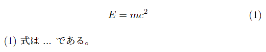

<!--10-->
<!--align環境（ディスプレイ数式）-->

- **入力**
    
    ```latex
        \begin{align} 
            E=mc^2 \label{name} 
        \end{align}
        (\ref{name}) 式は ... である。
    ```
    
- **出力**

    

---

- **関連リンク**

    <div class="related-link-wrapper">
      [modal-1]<!--数式内の書体関連--><br>
      [modal-4]<!--＄…＄ （インライン数式）-->
    </div>