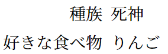

<!--5-->
<!--記号付き箇条書き（item環境）-->

### 基本的な使い方

---

- **入力**
    
    ```latex
      \begin{itemize}
        \item テキスト 1 
        \item テキスト 2 
      \end{itemize}
    ```
    
- **出力**
    
    
    

### スペースの調整

---

- enumitemパッケージを使って調整するとよい：[modal-6]<!--番号付き箇条書き（enumitem環境）-->

  ```latex
    \usepackage{enumitem} % enumerateパッケージの拡張版。
    
    % すべてのitemize, enumerateで適用
    \setlist{temsep=1ex, leftmargin=1cm}
  ```

### 見出しの変え方

---

- `\item[見出し]`とすると、見出しを変えられる。
- 見出しの長さが違うときには、見出しの右端が揃う。
    
    ```latex
      \begin{itemize}
        \item[種族] 死神
        \item[好きな食べ物] りんご
      \end{itemize}
    ```
    
    
    
- {左揃え（+太字）の見出しを出力したいとき：}[modal-7]<!--見出し付き箇条書き（description環境）-->

---

- **関連リンク**

    <div class="related-link-wrapper">
      [modal-6]<!--番号付き箇条書き（enumitem環境）--><br>
      [modal-7]<!--見出し付き箇条書き（description環境）-->
    </div>