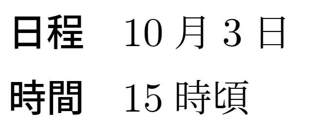

<!--7-->
<!--見出し付き箇条書き（description環境）-->

### 基本的な使い方

---

- **入力**
    
    ```latex
    \begin{description}
        \item[日程] 10月3日
        \item[時間] 15時頃
    \end{description}
    ```
    
- **出力**
    
    
    

### **見出しと本文の間に改行**

---

`\item[○○]\mbox{}\\`で改行できる。

- **入力**
    
    ```latex
    \begin{description}
        \item[走れメロス] \mbox{}\\
        メロスは激怒した。
        必ず、かの邪智暴虐の王を除かなければならぬと決意した。
        メロスは、村の牧人である。
        笛を吹き、羊と遊んで暮して来た。
        けれども邪悪に対しては、人一倍に敏感であった。
        (太宰治、1940年より)
        \item[檸檬] \mbox{}\\
        えたいの知れない不吉な塊が私の心を始終圧えつけていた。
        焦躁と言おうか、嫌悪と言おうか---
        酒を飲んだあとに宿酔があるように、
        酒を毎日飲んでいると宿酔に相当した時期がやって来る。
        それが来たのだ。
        (梶井基次郎、1931年より)
    \end{description}
    ```
    
- **出力**
    
    
    

### 見出しと文章の境目を合わせる

---

指定しない場合：見出しの左端を合わせるため文章の境目が合わない。

`enumitem`パッケージを導入し、labelwidthオプションで指定するとよい。

- **入力**
    
    ```latex
    \usepackage{enumitem}
    ...
    \begin{description}[labelwidth=7em] %（一番長い見出しの文字数）emとする
        \item[長い見出し] 文
        \item[短] 文\\
        \vdots
        \item[一番長い見出し] 文
    \end{description}
    ```
    

- **出力**
    
    
    

---

- **関連リンク**

    <div class="related-link-wrapper">
      [modal-5]<!--記号付き箇条書き（item環境）--><br>
      [modal-6]<!--番号付き箇条書き（enumitem環境）--><br>
      [modal-7]<!--見出し付き箇条書き（description環境）-->
    </div>