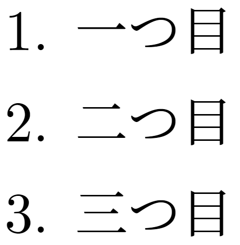
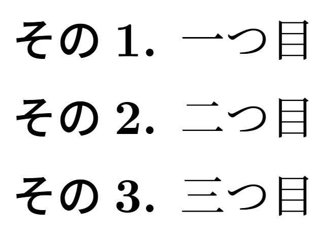
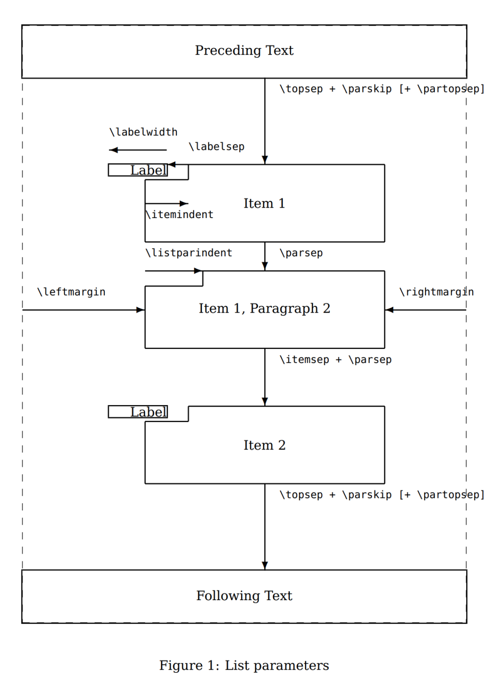
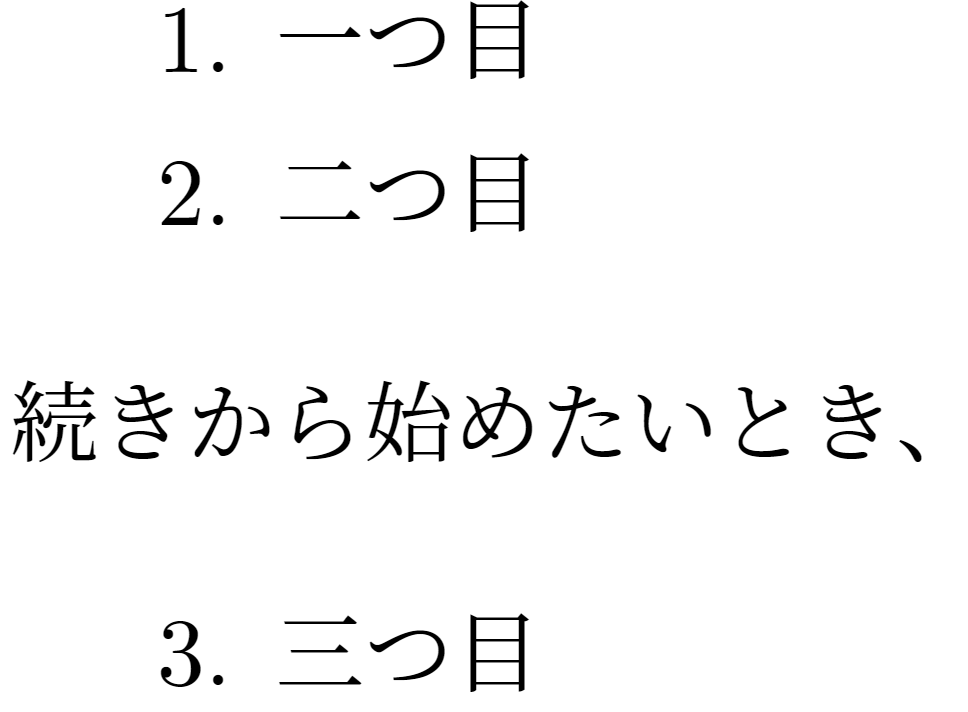

<!--6-->
<!--番号付き箇条書き（enumitem環境）-->

### 基本的な使い方

---

- **入力**
    
    ```latex
        %\usepackage{enumerate} % 古いパッケージ。
        \usepackage{enumitem} % enumerateパッケージの拡張版。こっちを使う！
        
        \begin{enumerate}
            \item 一つ目
            \item 二つ目
            \item 三つ目
        \end{enumerate}
    ```
    
- **出力**
    
    
    

### **番号ルールを変更**

---

- 全体の番号の付け方を変更したいときは、`renewcommand`を使う。
    
    ```latex
        %プリアンブルに記載
        %第1階層をローマ数字（i, ii, ...）にし、(i), (ii)のような表示にしたい場合
        \renewcommand{\theenumi}{\roman{enumi}} %ローマ数字に
        \renewcommand{\labelenumi}{(\theenumi)} %(i)形式に
    ```
    
- 番号の振り方は、以下から変更できる。
    - アラビア数字（1, 2, …）：`\arabic`
    - ローマ数字（i, ii, …／I, II, …）：`\roman`, `\Roman`
    - アルファベット（a, b, …／A, B, …）：`\alph`, `\Alph`
- 第1 - 4階層まで指定できる（\the+enum+番号）。
    - 第1階層：`\theenumi`
    - 第2階層：`\theenumii`
    - 第3階層：`\theenumiii`
    - 第4階層：`\theenumiv`
- (1.1)などのように、上位階層を含めた番号付けも可能。
    - 上位階層を指定するときは\the+enum+番号をつかう。
    
    ```latex
        %第2階層を(1.1)のように(第1階層.第2階層)とする
        
        %第1階層の書式指定
        \renewcommand{\theenumi}{\arabic{enumi}} %ローマ数字に
        \renewcommand{\labelenumi}{(\theenumi)} %(1)形式に
        
        \renewcommand{\theenumii}{\theenumi.\arabic{enumii}} %ローマ数字.ローマ数字　の形式に
        \renewcommand{\labelenumii}{(\theenumii)} %( )で囲む
    ```
    

### **各環境ごとにラベルの付き方を指定**

---

- enumitemパッケージでは、オプションでラベルの付き方を指定できる。
    
    ```latex
        \begin{enumerate}[label=\textbf{その\arabic*.}]
            \item 一つ目
            \item 二つ目
            \item 三つ目
        \end{enumerate}
    ```
    
    
    
- `\arabic*`の部分は、上記の番号の振り方に`*`をつければよい。

### **スペースの調整**

---

- ラベルやインデント、マージンの幅などを調整できる。
    
    ```latex
        %スペース調整の例
        \begin{itemize}[itemsep=1ex, leftmargin=1cm]
    ```
    
- 各長さの名称は下図に準拠する。
    
    
    
- あるいは、文書すべてで指定したいとき
    
    ```latex
        % すべてのitemize, enumerateで適用
        \setlist{temsep=1ex, leftmargin=1cm}
        
        % itemizeで適用
        \setlist[itemize]{temsep=1ex, leftmargin=1cm}
        
        % enumerateの第2階層で適用
        \setlist[enumerate,2]{temsep=1ex, leftmargin=1cm}
    ```
    

### **番号（カウンタ）の再設定**

---

- ある番号からスタートしたいとき
    
    ```latex
    \begin{enumerate}[start=4] % 「4」からスタートする。
        \item 四つ目
        \item 五つ目
        \item 六つ目
    \end{enumerate}
    ```
    
- あるいは、前の番号の続きから始めたいときには、次のようにする。
    
    ```latex
    \begin{enumerate}
        \item 一つ目
        \item 二つ目
    \end{enumerate}
    
    続きから始めたいとき、
    \begin{enumerate}[resume]
        \item 三つ目
    \end{enumerate}
    ```
    
    
    

---

- **関連リンク**

    <div class="related-link-wrapper">
      [modal-5]<!--記号付き箇条書き（item環境）--><br>
      [modal-6]<!--番号付き箇条書き（enumitem環境）--><br>
      [modal-7]<!--見出し付き箇条書き（description環境）-->
    </div>