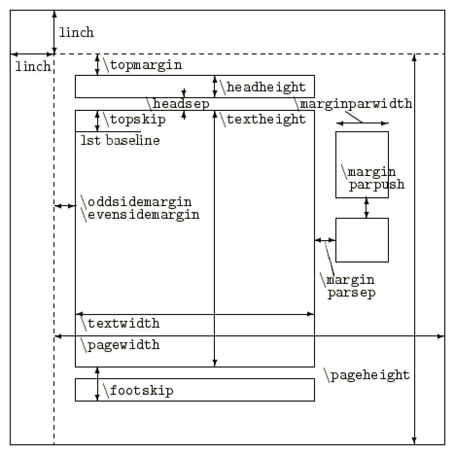

<!--15-->
<!--ページレイアウト-->



ページレイアウトを変更するには、プリアンブルで上図のパラメータ値を変更する。
ただし、余白設定はgeometryパッケージで行う方がよい。
こちらはあくまで参考までに。

```latex
    %\setlengh{パラメータ}{値}の順
    \setlengh{\textheight}{10pt}
```

- **関連リンク**
    
    <div class="related-link-wrapper">
      [modal-3]<!--余白設定(geometryパッケージ)--><br>
      [modal-17]<!--行送り、行間の調整-->
    </div>