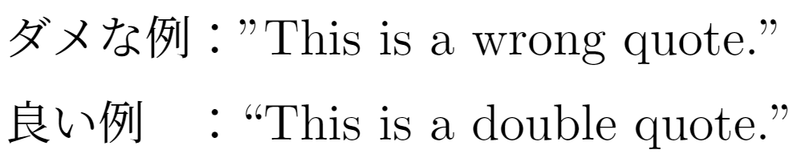
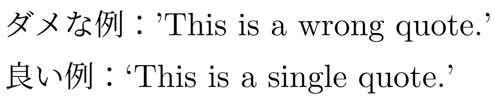

<!--24-->
<!--クォーテーションの書き方-->

<aside class="warning">
    <div>
    ダブルクォーテーション、シングルクォーテーションを打ちたいときに、<code>" "</code>や<code>' '</code>とするのは誤りです。<br>
    LaTeXでは、必ずバッククォートとシングルクォートのペアで用います。
    </div>
</aside>

### ダブルクォーテーション
---
- **入力**
    - 始まりはバッククォート2つ<code>``</code>
    - 終わりはシングルクォート2つ`''`
        
    ```latex
        ダメな例："This is a wrong quote."
        
        良い例：``This is a double quote.''
    ```
    
- **出力**

    


### シングルクォーテーション
---
- **入力**
    - 始まりはバッククォート1つ<code>`</code>
    - 終わりはシングルクォート1つ<code>'</code>
        
    ```latex
        ダメな例：'This is a wrong quote.'
        
        良い例：`This is a single quote.'
    ```
    
- **出力**    

    

---

