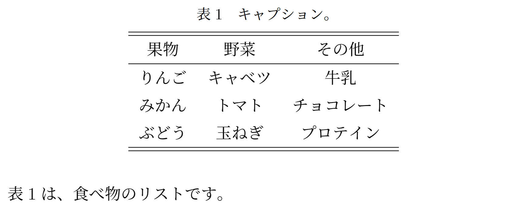

<!--2-->
<!--表挿入（tabular環境）-->

- **入力**

```latex
	\begin{table}[htbp]
		\centering
		\caption{キャプション。}
		\label{table1}
		\begin{tabular}{ccc}
			\hline\hline
			果物 & 野菜 & その他 \\\hline
			りんご & キャベツ & 牛乳 \\
			みかん & トマト & チョコレート \\
			ぶどう & 玉ねぎ & プロテイン \\
			\hline\hline
		\end{tabular}
	\end{table}

	表\ref{table1}は、食べ物のリストです。
```

- **出力**
    
    
    

---

- **関連リンク**

    <div class="related-link-wrapper">
      [modal-1]<!--数式内の書体関連--><br>
      [modal-12]<!--図の挿入（figure環境）--><br>
      [modal-21]<!--シンプルに図を貼る（マクロ）--><br>
      [modal-22]<!--Excel等で作った表をTeXに挿入--><br>
      [modal-27]<!--ハイパーリンクをつける（hyperrefパッケージ）--><br>
      [modal-9]<!--好きな位置に図表を配置（floatパッケージ）-->
    </div>