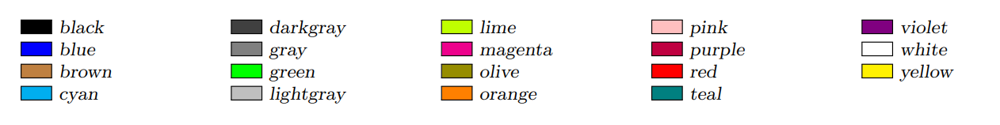
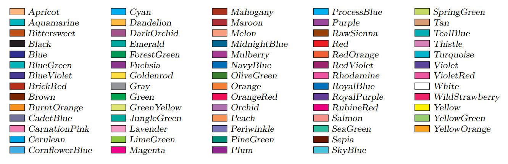
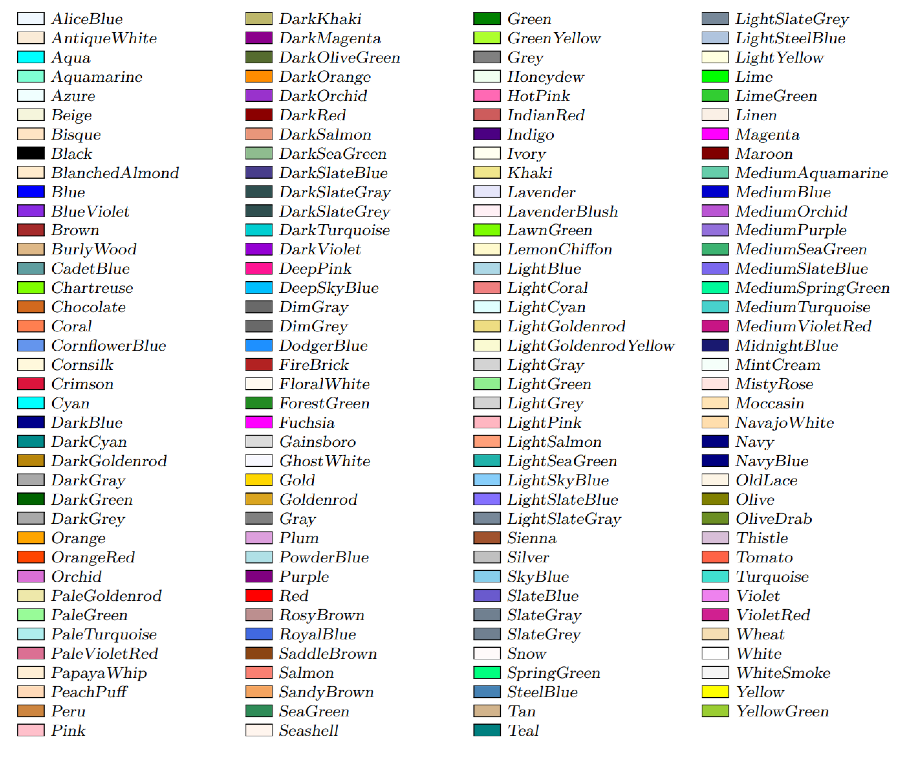
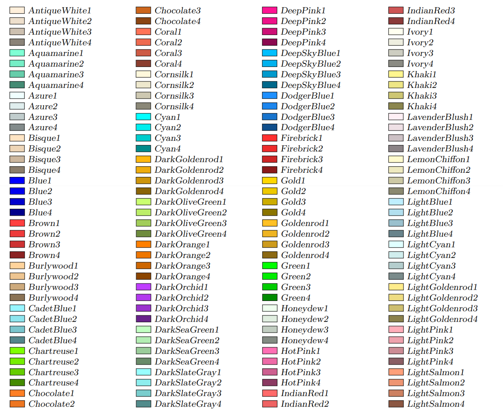
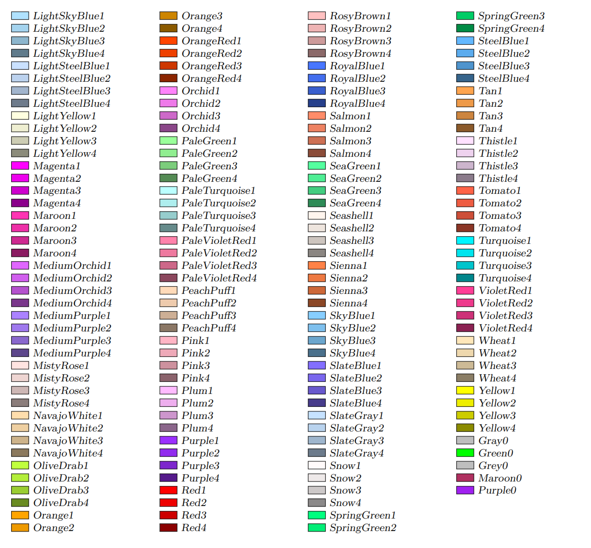

<!--12-->
<!--文字色指定(xcolorパッケージ)-->

### xcolorパッケージ

---

- xcolorパッケージの利用により、graphixパッケージの挙動が不安定になることがある。
- この対策として、以下のようにdocumentclassのオプションにdvipdfmxを加えておくと安心。
    
    ```latex
        \documentclass[dvipdfmx]{jsarticle}
        \usepackage{graphix}
        \usepackage{xcolor}
    ```
    
- optionなしでは、以下の色が使える。
    
    
    
    ```latex
        %テキストの色を変更(書き方は2通り)
        %1
        \textcolor{red}{この文字は赤くなります。}
        %2
        {\color{blue}この文字は青くなります。}
    ```
    

### 使える色

---

- `\usepackage[オプション]{xcolor}`のように、オプションを指定して色数を増やせる。
    
    
    | **option** | **使える色** |
    | --- | --- |
    | なし | 上記の19色 |
    | `dvipsname` | 68色 |
    | `svgnames` | 151色 |
    | `x11names` | 317色 |

    - `dvipsname`
        
        
        
    - `svgnames`
        
        
        
    - `x11names`
      
        

        
    
- **入力**
    ```latex
        \textcolor{Orchid}{e.g.)\ Orchid（＝淡紫色）になりました。}
    ```
- **出力**
    <div>
    $$
    \textcolor{Orchid}{\text{e.g.)\ Orchid（＝淡紫色）になりました。}}
    $$
    </div>

- もっと自分で定義した色とかも使いたい！という場合：[modal-23]<!--(マクロ)色を定義して使う-->


---

- **関連リンク**

    <div class="related-link-wrapper">
      [modal-23]<!--色を定義して使う（マクロ）-->
    </div>