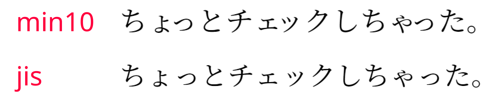
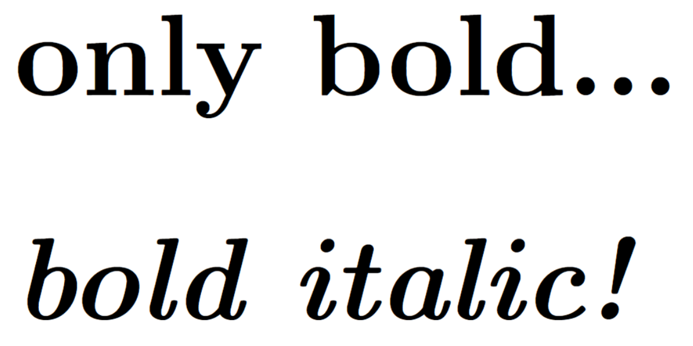

# まえがき

---

LaTeXは歴史のあるソフトで、1993年に$\LaTeX2e$がリリースされてから今日まで、多数のパッケージによる拡張がされています。

このような背景の中で、互換性の問題のあるコマンドや、より拡張された代替コマンドがあるために、**現環境で使用すべきではないコマンド**も存在します。

しかしながら、このような背景を知らず、古いコマンドを利用している方も多いと感じます。

そのため、特に頻出で重要度の高いものを中心に、廃止されたコマンド類をまとめていこうと思います。

なお、以下を参考にして作成しています。

- <span class="exlink">[改訂第8版-LaTeX2e美文書作成入門-奥村晴彦](https://www.amazon.co.jp/%E6%94%B9%E8%A8%82%E7%AC%AC8%E7%89%88-LaTeX2%CE%B5%E7%BE%8E%E6%96%87%E6%9B%B8%E4%BD%9C%E6%88%90%E5%85%A5%E9%96%80-%E5%A5%A5%E6%9D%91%E6%99%B4%E5%BD%A6/dp/4297117126)</span>
- <span class="exlink">[Obsolete Packages and Document Classes — Avoid Usage!](https://latex.org/forum/viewtopic.php?f=37&t=6637)</span>
- <span class="exlink">[An essential guide to LATEX 2ε usage -Obsolete commands and packages-](https://jp.mirrors.cicku.me/ctan/info/l2tabu/english/l2tabuen.pdf)</span>

# PostScript(またはEPS)形式の画像を貼る

---

たまに、「TeXに貼る画像はEPS形式でないとダメだ！」とかいう化石みたいな情報を見ることがありますが、**ただの時代遅れなので無視**しましょう。

以下に、一般的に知られる画像形式における、(u)pLaTeX+dvipdfmxの互換性をまとめました。

| **画像形式** | **挿入可／不可** | **変換などの有無** | **画像の種類** |
| --- | --- | --- | --- |
| PNG | 可 | なし | ラスター |
| JPEG | 可 | なし | ラスター |
| TIFF | 不可 | PNGなどに変換 | ラスター |
| BMP | 不可 | PNGなどに変換 | ラスター |
| GIF | 不可 | PNGなどに変換 | ラスター |
| PDF | 可 | なし | ベクター(orラスター) |
| EPS | 可(非推奨) | なし | ベクター |
| SVG | 標準は不可 | `\usepackage{svg}`すれば<br>直接貼り付け可能 | ベクター |

よって、推奨される画像形式は以下になります。

- ラスター画像ならJPEGかPNG。それぞれの形式の特性を考えると、色数の多い写真などはJPEG、色数の少ない図などはPNGが推奨されます。
- ベクター画像ならPDF一択。
なお、PDFはラスター画像を含めることもできますがラスターとして使うのはあまり一般的でも効率的でもありません。

# jシリーズ(ドキュメントクラス)

---

**(u)pLaTeX + dvipdfmxの場合**

- jarticleやjreport、jbookは、古いドキュメントクラスなので非推奨。
- 代わりに新しいjsシリーズ(`jsarticle`、`jsreport`、`jsbook`)を使う。
    - カラーの画像を貼る場合には、最低限dvipdfmxのオプションは付けておく。
    - その他のオプションは：<span class="familylink">[ドキュメントクラス](../CheatSheet/LaTeX-CheatSheet.html){:target="_blank"}</span>

```latex
% \documentclass{jarticle} %使ってはいけない
\documentclass[dvipdfmx]{jsarticle} %こっちを使う
```

<aside class="pinned">
<div>
古いjシリーズはmin10.tfmというフォントメトリックを使用しており、小さい文字同士の隙間が詰まりすぎるなどの欠陥があった。

一方、jsシリーズで用いられているjis.tfmは、かな漢字は全角、約物は半角というJIS規格に従って組版できる。




画像は、jarticle(上部)、jsarticle(下部)で出力した例。

jarticleの方は「ょ」と「っ」、「ゃ」と「っ」の間が不自然に詰まっている。

</div>
</aside>

# フォントエンコード

---

- (一種のおまじないだと思って)以下の記述をプリアンブルに書いておく。

```latex
% プリアンブル
% エンコーディングを指定
\usepackage[T1]{fontenc} % T1エンコード
\usepackage{textcomp} % TS1エンコード
```

この理由については：<span class="familylink">[こちら](../LaTeX-sahou/LaTeX-sahou.html#header-9)</span>

# 古い番号付き箇条書き：enumerateパッケージ

---

- 拡張版のenumitemパッケージがあるので、こっちを使う。
- 詳しい使い方：<span class="familylink">[番号付き箇条書き（enumitem環境）](../CheatSheet/LaTeX-CheatSheet.html){:target="_blank"}</span>

# \baselinestretchの再定義による行間調整

---

- `\renewcommand{\baselinestretch}{倍率}`で行間をいじる手法がネットでは紹介されていたりするが、そもそもこのような**コマンドの再定義はなるべく避けた方がよい。**

> 経験則として、パラメータはユーザー・インターフェースの中で可能な限り高いレベルで設定されるべきである。
> 行間スペースをリセットしたい場合は、3つのレベルで行うことができる：
> 
> 1. setspace.sty パッケージを使う。
> 2. コマンド`\linespread{<factor>}`を使う。
> 3. `\baselinestretch`を再定義する。
> 
> このようなパラメータの再定義は、LATEXの最も低いレベルで動作するので、これはパッケージに任せるべきである。すなわち、`\baselinestretch`をいじるよりも、`\linespread`コマンドが行間を空ける良い方法である。
> 
> しかし、setspace.styを使えば、脚注やリスト環境など、行間スペースを変更するときに通常は変更したくないスペースも処理できるので、さらによい。
> 
> 行間をもう少し空けたい、例えば行間を半分にしたい、あるいは二重に空けたい場合、setspace.sty を使うのが一番簡単だ。
> 
> ただし、Computer Modern 以外のフォントを使いたい場合は、`\linespread{<factor>}`を使ってもよい。例えば、Palatino を使う場合は、`\linespread{1.05}`が適当である。
> 

([An essential guide to LATEX 2ε usage](https://jp.mirrors.cicku.me/ctan/info/l2tabu/english/l2tabuen.pdf)より引用、和訳)

- よって、次のようにするのが最もよい。

```latex
\usepackage{setspace} % setspaceパッケージ読み込み
\setstretch{1.05} % ページ全体の行間を設定
```

# 古いフォントスタイルの変更手法(`\bf`、`\it`など)

---

- 基本的に2文字のコマンドは古いコマンドだと思ってよい。
    
    
    | **スタイル** | **廃止** | **(適切)一時的に変更** | (適切)数式内で一時的に変更 | **(適切)全体の変更** |
    | --- | --- | --- | --- | --- |
    | 太字(bold) | {\bf text} | \textbf{text} | \mathbf{text} | \bfseries |
    | 強調 | - | \emph{text} | - | \em |
    | イタリック体 | {\it text} | \textit{text} | \mathit{text} | \itshape |
    | デフォルトの太さの書体 | - | \textmid{text} | - | \mdseries |
    | ローマン体 | {\rm text} | \textrm{text} | \mathrm{text} | \rmfamily |
    | スモールキャピタル | {\sc text} | \textsc{text} | - | \scshape |
    | サンセリフ体 | {\sf text} | \textsf{text} | \mathsf{text} | \sffamily |
    | スラント体(いわゆる斜体) | {\sl text} | \textsl{text} | - | \slshape |
    | タイプライタ体 | {\tt text} | \texttt{text} | \mathtt{text} | \ttfamily |
    | 立体 | - | \textup{text} | - | \upshape |
    
    <aside class="pinned">
    <div>
    廃止されたコマンドは、2重でスタイルを適用することができない。
    
    ```latex
    {\it \bf only bold...} % 不適切なコマンド
    \textit{\textbf{bold italic!}} % 適切なコマンド
    ```
    
    

    </div>
    </aside>
    

# 図表におけるcenter環境

---

- 図表などをセンタリングするときの`\begin{center}…\end{center}`は、よく使われているのを見るけれど、変な隙間が空いてしまうため非推奨。
- `\centering` で中央に寄せるほうがよい。なお、図表以外だったら使ってOK。

```latex
% よくない
%\begin{figure}
%  \begin{center}
%    \includegraphics{hoge}
%  \end{center}
%\end{figure}

% よい
\begin{figure}
  \centering
  \includegraphics{hoge}
\end{figure}
```

# appendix環境

---

- appendix環境は古いスタイル。`\appendix`を使うとよい。

```latex
% よくない
%\begin{appendix}
%  \section{huga}
%\end{appendix}

% よい
\appendix
\section{huga}
```

# フォント

---

- フォント変更の際にも、古いコマンドを使うべきではない。以下にいくつか列挙する。
    - **times.sty**
        
        ```latex
        % \usepackage{times} % 古い
        
        \usepackage{mathptmx}
        \usepackage[scaled=.90]{helvet}
        \usepackage{courier}
        ```
        
    - **mathptm.sty**
        
        ```latex
        % \usepackage{mathptm} % 古い
        
        \usepackage{mathptmx}
        ```
        
    - **pslatex.sty**
        
        ```latex
        % \usepackage{pslatex} % 古い
        
        \usepackage{mathptmx}
        \usepackage[scaled=.90]{helvet}
        \usepackage{courier}
        ```
        
    - **palatino.sty**
        
        ```latex
        % \usepackage{palatino} % 古い
        
        \usepackage{mathpazo}
        \usepackage[scaled=.95]{helvet}
        \usepackage{courier}
        ```
        
    - **euler.sty**
        
        ```latex
        % \usepackage{euler} % 古い
        
        \usepackage{eulervm}
        ```
        

# eqnarray環境

---

- amsmath.styでサポートされていないので、使わない。
- 複数行、別行立てのコマンドはalign環境を使う。

```latex
% 使わない
%\begin{eqnarray}
%...
%\end{eqnarray}

% 1行、別行立て数式(番号なし)
\[ ... \]

% 1行、別行立て数式
\begin{equation}
...
\end{equation}

% 複数行、別行立て数式
\begin{align}
...
\end{align}
```