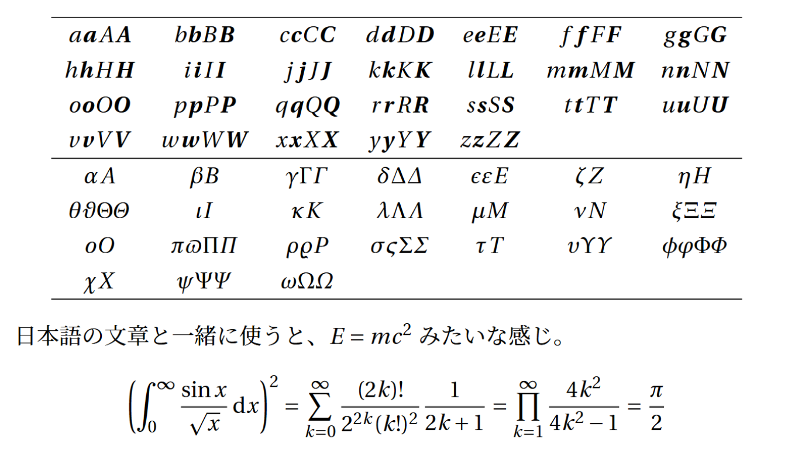

# デフォルトのフォントはアレ

---

$\text{\TeX}$のデフォルトのフォントはComputer Modernといって、$\text{\TeX}$の作者のD. E. Knuthさんがつくったフォントです。

歴史的に重要なフォントですが、今となっては古いエンコード方式を使っているので、新しいフォントを使うべきとされています。

さらに、日本語と合わせて使うにはもう一つ問題があります。

それは、ちょっと数式が細い！ということです。


なので、数式フォントを色々変えて、日本語フォントとの相性をみてみましょう。

フォントを見る際には、紛らわしい文字同士の区別がつくか（アルファベットのvとギリシャ文字のνなど）も重要ポイントです。

# newtxmath

---

- 使っている人を多く見かけます。ぱっきりとしたスタイリッシュなフォントです。
- 個人的には、斜体のzにひげがあるのがちょっと気になります。
    
    ```latex
    \usepackage{newtxtext,newtxmath}
    ```
    
    

    

<aside class="warning">
<div>

デフォルトでは、v（ブイ）の形がν（ニュー）に類似してしまいます。
角ばっていない丸いv（ブイ）を出すには、`\varv`とすれば出すことができます。

- \varvをデフォルトにしたい場合、①オプションで`varg`を指定する、または②vの文字だけを`\DeclareMathSymbol` で変更する、という処置ができます。前者の場合は、vだけでなくg, y, wも変わってしまいます。
    
    ```latex
    % 1. オプションでvargを指定する
    \usepackage[verg]{newtxmath}
    ```
    
    ```latex
    % 2. vの文字だけを\DeclareMathSymbol で変更する
    \usepackage{newtxmath}
    \DeclareMathSymbol{v}{\mathord}{lettersA}{190}
    ```
    

- ①の場合の出力は以下のようになります。

")

</div>
</aside>

# newpxmath

---

- newtxmathの親戚で、Timesの代わりにPalatinoというフォントをもとにしています。
- newtxmathと比べると、強弱の付け方が繊細で、独特のエレガントさがあります。

```latex
\usepackage{newpxtext,newpxmath}
```


# Linux Libertine

---

- 個人的に大好きなフォントです。Wikipediaのロゴなどにも使われているフォント。
- 丸みがあってかわいいです。
    
    ```latex
    \usepackage[proportional]{libertine}
    \usepackage{libertinust1math}
    ```
    
    
    

<aside clsaa="bulb">
<div>

newtxmathとの混植で指定することもできます。記号類や字間はnewtxmath、アルファベットなどはLibertineになります。

```latex
\usepackage{libertine}
\usepackage[libertine]{newtxmath}

\DeclareMathSymbol{g}{\mathord}{lettersA}{188}
\DeclareMathSymbol{y}{\mathord}{lettersA}{189}
\DeclareMathSymbol{v}{\mathord}{lettersA}{190}
\DeclareMathSymbol{w}{\mathord}{lettersA}{191}
```

")

- gの形を変えたいときは、以下を書きます。

```latex
\usepackage{libertine}
\usepackage[libertine]{newtxmath}

%\DeclareMathSymbol{g}{\mathord}{lettersA}{188} これはコメントアウト。

\DeclareSymbolFont{libertineg}{\encodingdefault}{\familydefault}{m}{it}
\SetSymbolFont{libertineg}{bold}{\encodingdefault}{\familydefault}{b}{it}
\DeclareMathSymbol{g}{\mathalpha}{libertineg}{`g}

\DeclareMathSymbol{y}{\mathord}{lettersA}{189}
\DeclareMathSymbol{v}{\mathord}{lettersA}{190}
\DeclareMathSymbol{w}{\mathord}{lettersA}{191}
```

"){:class="img-center"}

</div>
</aside>

# mathptmx

---

- newtxmathと比較して、グリフには大きな差異がありませんが、文字間の余白がこちらのほうが小さくなります。
- `\bm` とはいっしょに使えません（後述）。
    
    ```latex
    \usepackage{mathptmx}
    ```
    
    
    

<aside class="warning">
<div>

- マニュアルにもあるように、`\bm`との相性は悪いです（以下は抜粋）。
    
    > There are no bold math fonts, and `\boldmath` as no effect. Use of the package bm in conjunction with mathptmx is not recommended.
    > 
- 具体的には、`\usepackage{bm}`を`\usepackage{mathptmx}`より前に書くと、`\bm`がComputer Modernになってしまいます。
- また、逆の順番にすると、上記の例のように`\bm`が重ねうち(Poor Man’s Bold)になってしまいます。
  
</div>
</aside>

# mathpazo

---

- mathptmxのTimesをPalatinoにしたものです。
- mathptmxよりもこちらの方が完成度が高く、キレイなフォントです。`\bm` も問題なく使えます。
    
    ```latex
    \usepackage{mathpazo}
    ```
    
    
    

<aside class="warning">
<div>

Palatinoをもとにしたフォントは、Times系のフォントに慣れている人には癖が強く感じるかも？　私はかなり好きですが……。

</div>
</aside>

# Utopia/fourier-GUTenberg

---

- Adobeが作った数式フォントです。Adobe製ですが無償提供されています。
- 全体的に癖は少なめです。太めなので和文にも合います。
- 数式中の大きいカッコが独特な感じです。
    
    ```latex
    \usepackage{fourier}
    ```
    
    
    

# fouriernc

---

- fourier-GUTenbergで、UtopiaをCentury Schoolbookに置き換えたものです。
- fourierと比較してより黒さが増した印象です。和文中で使うと教科書みたいで可愛い！
- kが筆記体みたいにまるっとします。
- ウプシロンとvがほぼ同じだけど、ウプシロンを使う機会ないから関係ないか。
    
    ```latex
    \usepackage{fouriernc}
    ```
    
    
    

# mathdesign

---

- mathdesignパッケージは、本文や数式をUtopiaなどで置き換えます。
- なぜかUtopia/fourier-GUTenbergを使ったときと出力が変わります。
- やや字間が広すぎる部分があります（$E=mc^2$のところとか）。
    
    ```latex
    \usepackage[utopia]{mathdesign}
    ```
    
    
    

# STIX2

---

- STIX (Scientific and Technical Information Exchange)フォントは、AMS, APSなどが共同で開発したオープンライセンスのフォントです。今はSTIX2というのが出ています。
- 科学技術出版に必要なすべてのUnicode文字が含まれています。
- デザイン的にはTimes系だと思います。Wordでも使えるらしい。
    
    ```latex
    \usepackage{stix2}
    ```
    
    
    

# 総括｜結局どれを使えばいいか？

今回は一部のフォントを紹介しましたが、TeXにはまだまだいろんな数式フォントがあります。

今回はセリフ体に絞って紹介しましたが、サンセリフ体のフォントもあります（arevとかlxfontsとかiwanaとかが有名）。

もっといろんなフォントが見たい人は[The LaTeX Font Catalogue](https://tug.org/FontCatalogue/mathfonts.html)などを参考にして選ぶとよいでしょう。

どれを使えばいいか？　の答えとしては、基本的に好きなのを使えばよいと思います。

一点だけ注意として、**bmパッケージを使うなら、mathptmxなどの太字に対応していないフォントは使わない**ようにしましょう。

意外と対応していないのも多いみたいです。