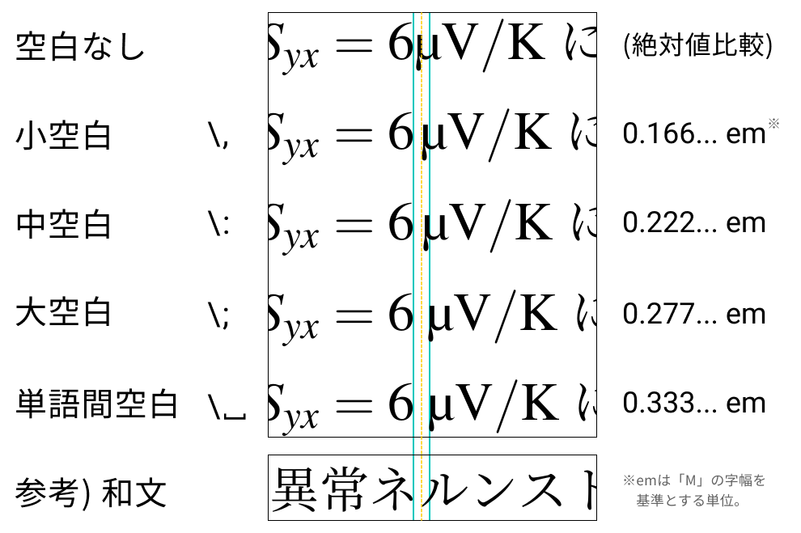
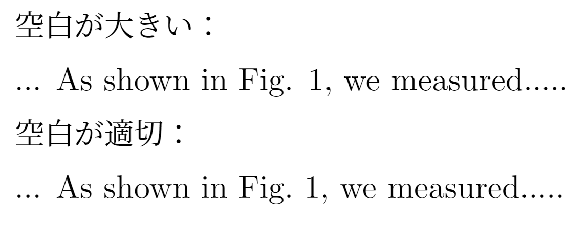

# きれいなLaTeX文書を書くために

---

きれいなLaTeX文書を作るために、最低限押さえておきたいルールをまとめました（順次追加します）。


{::nomarkdown}
<details  class= "details" markdown="1">
    <summary class="summary"><span class="summary-inner">[Change Log]</span></summary>
    <div class="details-content">
    <div class="details-content-inner">
{:/nomarkdown}


**2025/02/19**
- 「℃の出力方法」項目を追加。

---

**2024/10/27**
- 「数字と単位の間のスペース」項目の修正。
- 「ハイフン/enダッシュ/emダッシュの使い分け」項目を追加。

---

**2024/10/24**
- 計28項目を公開。

{::nomarkdown}
  </div>
  </div>
</details>
{:/nomarkdown}


# （TeXとは関係のない）文書作成全般

---

## testスペースの入れ方

- 和文で「、」「。」を使う場合は、後ろにスペースを入れない。
- 欧文で「,」「.」を使う場合は、後ろに半角スペースを入れる。
    - 例：I have two dogs,<span class="highlight-red">⌴</span>three cats and one turtle.<span class="highlight-red">⌴</span>They are very cute.

## 数字の全角・半角の使い分け

- 原則として、数字は半角で入力し、日本語と混在する場合でも一貫性を持たせる。
    
    <aside class="pinned">
    <div>
    統一していればどちらでもいいという考え方もありますが、数式を含むような文章においては、半角数字の方が一貫性があると思います（主観です）。
    </div>
    </aside>
    

## 全角英字／全角スペースは使わない

- 数字と同じように、英字も全角文字は使わない（あるいは、使わないといけない場合でも、文書内で必ず統一する）。
- **スペースも全角スペースは使わない。**LaTeXでは、コマンド内に全角文字があるとエラーの原因になります。
- 空白を空けたいなどの場合は、`\`  や`\quad` などを使うこと。

## 改行・段落を適切に挿入する

- 文の流れが変わる、話題が変わるところで改行や段落を分ける。無理に一つの段落に詰め込まない。

## 斜体、立体の使い分け

- **斜体にするもの**

  - 物理量、数学的変数

- **立体にするもの**

  - 地の文、単位、組成式、数字、約物（句読点やかっこ）など

# 体裁関係（LaTeX特有）

---

## 適切なドキュメントクラスの選択

- **(u)pLaTeX + dvipdfmxの場合**
    - 文書の種類に応じて、`jsarticle`、`jsreport`、`jsbook`、`jlreq`など適切なドキュメントクラスを選択する。
    - ドキュメントクラスにはdvipdfmxオプション必須
        
        ```latex
        % 例
        \documentclass[12pt,uplatex,dvipdfmx,a4j]{jsreport}
        ```
        
- **jlreqの場合**
  - オプションなしだと`article`相当の文書になるので、必要に応じてオプションに`report`や`book`を加える（LuaLaTeXにも対応）。

## フォントエンコーディング

- (u)pLaTeXを使っている場合、（一種のおまじないだと思って）以下の記述をプリアンブルに書いておく。
    
    ```latex
    % プリアンブル
    % エンコーディングを指定
    \usepackage[T1]{fontenc} % T1エンコード
    \usepackage{textcomp} % TS1エンコード
    ```
    
    <aside class="pinned">
    <div>
    従来のTeXフォント（Computer Modern Romanなど。今でもTeXのデフォルト）は、7ビットのOT1エンコーディングで格納されていました。
    
    7ビット文字で表せる文字数は$2^7=128$通りです。そのため、文字数上限で割り当てられなかったアクセント記号は合成でつくっていました（例：üは`\"{u}`など）。
    
    これにより、初期のTeXはいくつもの障害を抱えていました。
    
    - ハイフン処理ができない。例えば、Schrödingerという文字のハイフン処理（この場合はSchrö-ding-er）を`\hyphenation{Schr\"{o}-ding-er}` と定義したくてもエラーになる。
    - カーニング情報がおかしくなる。
    - `<` `>` `|`の入力は、¡ — ¿に化けてしまう。
    - pdfにしたときに文字列の検索やコピペがうまくいかないことがある。
    
    しかし、時代を経てコンピュータが進化した現環境では、(u)pLaTeXでも8ビットのT1エンコードを使うのが当たり前になってきています。
    
    - アクセント付き文字も一つの文字としてサポートされるので、他の文字と同じように扱える。
    - つまり、T1エンコードを指定さえすれば、変にアクセント処理なんかしなくても、直でウムラウトを打ち込んでOKになる。
    - 今は、T1であふれた文字をさらにTS1に格納しています。上記の2文は、これらの文字を使えるようにするための記述になります。
    </div>
    </aside>
    

## フォントの設定

- 上記に関連して、OT1エンコであるデフォルトフォント（Computer Modern Roman）ではなく、別のフォントを使うことが推奨される。
- 詳細は：<span class="familylink">[数式フォントを考える](../LaTeX-math-font/LaTeX-math-font.html)</span>

## コマンド内に全角文字を入れない

- 例えば、`\label{ラベル１}` のようにしない。コマンド内での2バイト文字の使用は厳禁。

## ハイフン/enダッシュ/emダッシュの使い分け

- TeXのテキストモードで使われるハイフン（-）は、実際には3種類を使い分けるのが望ましい。
- 
    
    
    | **名称** | **入力** | **使い道** | **例** |
    | --- | --- | --- | --- |
    | ハイフン | `-` | 単語同士を接続 | $a\text{-axis}$<br>$\text{X-ray}$ |
    | enダッシュ | `--` | 範囲を表す場合<br>連名のつなぎ | $\text{pp.~55--65}$<br>$\text{Fermi--Dirac statistics}$ |
    | emダッシュ | `---` | センテンスの区切り<br>英文の” ; ” に近い使い方<br>あんまり使わない。 | $\text{When to use --- and not use --- dashes}$<br>$\text{である---これは、言い換えると}\cdots$ |
- なお、数式モードで`-` を打った場合は「マイナス」になるので注意。数式内で使いたい場合は、`\text{}` や `\mathrm{}` の中に記述する。


## 数字と単位の間のスペース

- 数字と単位の間のスペースは、単なる半角スペースではなく、`\,`を使うべきである（らしい）。
    
    > …ところが、TeX に代表される数式組版ツールでは、もっと細かい制御が行われるのが一般的である。Knuth の TeXbook の169ページには、数字と単位の間は thin space（TeX の記法では `\,`）を入れるべきだと書かれている。…（[奥村 晴彦, 「**数字と単位の間のスペース」**](https://okumuralab.org/~okumura/misc/221209.html)より）
    > 

<aside class="pinned">
<div>

- ただし、上記はあくまで「欧文」での組版を前提としている。個人的には、**和文においてはそうとも限らない**と思っています。
- 和文はもともと字間が小空白`\,`と同じぐらい広く、`\,`だと空白がないようにも見えてしまいます（もっとも、空白なしと比較すればかなり違う）。
- 通常の空白と区別をつけたいなら、中空白`\:` や大空白`\;`あたりを使うのがよいかも。以下は比較です。
    
    
    
- SI単位を出力する`siunitx`パッケージを使う場合、`\qty{6}{\micro V}`とすると、数値と単位の隙間はデフォルトの`\,`になります。
- 例えば空白を`\:` に変えたいなら、プリアンブルに以下を記述します。
    
    ```latex
    \sisetup{quantity-product=\: }
    ```
</div>
</aside>

## （主に欧文の場合）ピリオドの扱いに注意

- 欧文では、小文字の後ろのピリオドは文末だと判定されてしまう。
    - そのため例えば「Fig. 1」などと書くときに、「.」と「1」の間のスペースが必要以上に大きくなってしまう。
- これを避けるため、文末ではないピリオドの後ろは、「~」を使って文末ではないことを明示し、適切な大きさのスペースを空ける。
    
    ```latex
    空白が大きい：
    ... As shown in Fig. 1, we measured.....
    
    空白が適切：
    ... As shown in Fig.~1, we measured.....
    ```
    
    
    
    

## 画像ファイル名に全角文字等を使わない

- 上項目に関連するが、画像のファイル名にも全角文字、全角・半角スペース、特殊文字などは使わない。
    - `includegraphics[width=0.9\linewidth]{猫.png}`のようになっていると、エラーする可能性があるため。

## 欧文の括弧の記法

- 欧文のクォート記号で囲むときは、開きの記号にバッククォート「`」、閉じの記号にシングルクォート「'」を使う。
    - シングルクォート「'」で囲みたいとき
        
        ```latex
        `This is a quote.'
        ```
        
    - ダブルクォート「"」で囲みたいとき
        
        ```latex
        ``This is a quote.''
        ```
        

## 特定の文字や記号のエスケープ

- `#`、`%`、`$`、`&`、`{`、`}`、`_`、`~`、`^`、`\` といった特殊記号は、直接使用せず、`\#`, `\%`, `\$` などのエスケープシーケンスを使う。

## ℃の出力方法

- ℃をそのまま打つと変なフォントになってしまうのでNG。
- `textcomp`パッケージを使っている場合、`\textcelsius`によって出力できる。
- あるいは、`siunitx`パッケージを使う場合、`\degreeCelsius`によって出力できる。こちらは他の単位も出力しやすくてオススメ。
  ```LaTeX
    \documentclass{jsarticle}
    \usepackage{siunitx}
    \begin{document} 
        \qty{1}{\celsius} \\ 1 ℃と出力される
    \end{document}
  ```

## インデントの自動制御

- 手動でスペースを入れず、`\indent` や `\noindent` を使って適切にインデントを制御する。
- 文書全体でインデントを調整したい場合は、プリアンブルに次のように書く。
    
    ```latex
    \setlength{\parindent}{0pt}
    ```
    

## 強制改行は基本使わない

- 特に地の分では、強制改行`\\`を使わずに空行を挟む方がよい。強制改行だと、字下げが同時に行われないため。
    
    ```latex
    % よくない例
    1段落目\\
    2段落目
    
    % よい例
    1段落目
    
    2段落目
    ```
    

## 改ページは `\newpage` や `\clearpage` で行う

- 改行を繰り返すことで改ページするなどはNG。
    
    ```latex
    % よくない例
    1ページ目
    \\
    \\
    \\
    \\
    \\
    \\
    \\
    \\
    2ページ目
    
    % よい例
    1ページ目
    \clearpage
    2ページ目
    ```
    
- `\newpage`：ソースに書いてある部分で改ページ
- `\clearpage`：それまでに挿入された図表などをすべて出力してから改ページ

## 余白の調整は `geometry` パッケージで行う

- 文書全体の余白は、`\geometry{}` コマンドを使って調整し、手動で改行やスペースを挿入して調整しない。
    
    ```latex
    \usepackage[top=25truemm,bottom=20truemm,left=20truemm,right=20truemm]{geometry}
    ```
    

## 目次の自動生成

- 目次を手動で作成せず、`\tableofcontents` コマンドで自動生成させる。セクションタイトルが変更された場合でも、目次が自動で更新される。

# コマンド・環境関係

## 数式モードの使い分け

- 数式を記述する際には、必ずインライン数式は `$` で囲み、ディスプレイ数式は`align`環境などを使う。混用しない。

## ギリシャ文字や特殊文字はコマンドで入力

- ギリシャ文字（例：`\alpha`、`\beta`）や特殊記号（例：`\%`、`\$`）は、直接入力せずコマンドを使う。

## 箇条書きは `itemize` 環境を使用

- 手動で「・」や「-」を使って箇条書きを作らず、必ず `\begin{itemize}` と `\item` を使うことで、適切にインデントされたリストを作成する。
    
    ```latex
    \begin{itemize}
    	\item 最初の項目
    	\item 次の項目
    	\item その次の項目
    \end{itemize}
    ```
    

## 番号付きリストは `enumerate` 環境を使用

- 手動で番号を付けずに、`enumerate` 環境を使用して番号付きリストを作成する。これにより、番号の管理が自動化され、再番号付けの手間が省ける。なお、[enumerate](http://ctan.org/pkg/enumerate)パッケージは古いパッケージで、拡張版の[enumitem](http://ctan.org/pkg/enumitem)パッケージを使うべき。
    
    ```latex
    % プリアンブル
    \usepackage{enumitem}
    
    % 以下本文中
    \begin{enumerate}
    	\item 最初の項目
    	\item 次の項目
    	\item その次の項目
    \end{enumerate}
    ```
    

## 参照は `\ref{}` と `\label{}` で管理

- 図表やセクションの参照には、手動で番号を入力せずに `\ref{}`を使い、対応する`\label{}` で管理する。これにより、参照の一貫性が保たれる。
    
    ```latex
    % 式の場合
    \begin{align} 
       E=mc^2 \label{eq:Einstein-eq} 
    \end{align}
    
    (\ref{eq:Einstein-eq}) 式は ... である。
    ```
    
- `\label{}` の命名規則は一貫して行うとよい。
    - 例：`sec:introduction`、`fig:diagram1`、`eq:Boltzmann-eq`

## 文献引用は `\cite{}` を使用

- 文献の引用は、`\cite{}` コマンドを使用し、手動で番号や著者名を記載しない。
    
    ```latex
    ボルツマン方程式は、非平衡状態における粒子の古典的な分布関数を記述する方程式である\cite{I.Terasaki.BB24384699}。
    ```
    

## 図のキャプションは `\caption{}` で付与

- 図や表の説明文は、必ず `\caption{}` コマンドを使用して付与し、手動で説明文を追加しない。
    
    ```latex
    % 図の場合
    \begin{figure}[htbp]
    	\centering
    	\label{fig1}
    	\includegraphics[width=0.9\linewidth]{neko.png}
    	\caption{これは猫です。}
    \end{figure}
    
    % 表の場合
    \begin{table}[htbp]
    	\centering
    	\caption{キャプション。}
    	\label{table1}
    	\begin{tabular}{ccc}
    		\hline\hline
    		果物 & 野菜 & その他 \\\hline
    		りんご & キャベツ & 牛乳 \\
    		みかん & トマト & チョコレート \\
    		ぶどう & 玉ねぎ & プロテイン \\
    		\hline\hline
    	\end{tabular}
    \end{table}
    表\ref{table1}は、食べ物のリストです。
    ```
    

## マクロやカスタムコマンドの使用

- 繰り返し使用するコードや文字列は、`\newcommand` を使ってマクロを作成する。
    
    ```latex
    % プリアンブル
    \newcommand{\YBCO}{YBa$_{2}$Cu$_{3}$O$_{7-\delta}$}
    
    \begin{document}
    	YBa$_{2}$Cu$_{3}$O$_{7-\delta}$と打ちたいときには、\YBCO と書けばよい。
    \end{document}
    ```
    

## 関数はコマンドで入力

- 例：$\sin x$ と打つ場合
    
    ```latex
    % よくない例
    \mathrm{sin}x
    
    % よい例
    \sin{x}
    ```