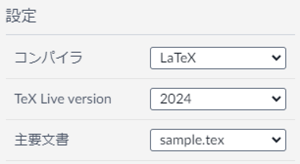
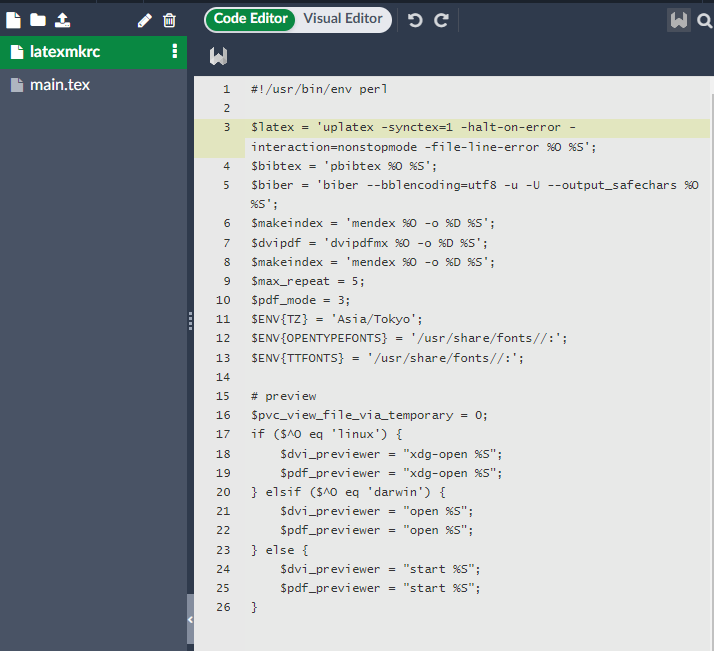

# Overleafとは

---

Overleaf は、科学文書の作成、編集、公開に使用される、クラウドベースの共同LATEX エディターです。
パッケージのサポート数も充実しており、ログインするだけで簡単にLATEX 文書を作成、管理できます。

ローカルでTeX文書を作成するときとは異なり、環境構築が不要な点が非常に使い勝手が良いです。
ただし、 日本語文書を書くためには、いくつか設定が必要です。

# Overleafで日本語を書く

---

 文書を作成する前に、Overleaf のサイト<span class="exlink">[https://ja.overleaf.com/](https://ja.overleaf.com/)</span> でアカウントを作り、ログインします。

ログインしたら、「新規プロジェクト」などで新しいTeXを作成できます。

日本語を書くためには、タイプセットの設定(要はコンパイラの設定)が必要です。

<aside class="bulb">
<div>
LaTeX はそもそも、英語(ラテンアルファベット)での組版のために作られています。したがって、そのままでは日本語を取り扱うことができません。

そこで、日本語文書では古くからLaTeXを拡張した**pLaTeX**が古くから使われています。

近年は、unicodeに対応した**upLaTeX**、後続の**XeLaTeX**や**LuaLaTeX**なども近年は使われ始めているようです。

筆者は2024年現在はupLaTeXを使っています。
（LuaTeXはLuaの構文とか書けてすごいけど、コンパイルがめちゃくちゃ遅い）
</div>
</aside>

さて、Overleafでの日本語文書作成のために、Overleaf上で`latexmkrc`というファイルを作成、追加する必要があります。

`latexmkrc` は、LaTeX 文書をビルドするためのツールである `latexmk` の設定ファイルです。

このファイルにカスタムコマンドやビルドの動作を指定することで、コンパイルプロセスを自動化したり、出力ディレクトリを変更するなどの細かな設定も簡単に行うことができます。

Overleafは、コンパイラとしてLaTeXは指定できますが、pLaTeXそのものを指定できません。latexでは、仮名漢字が混じった文章を打つとコンパイルエラーしてしまいます。

そこで、`latexmkrc`で明示的にコンパイラを指定してあげることで、(u)platexを使ったコンパイルを可能にするという仕組みです。

まずは、左上の「メニュー」から、コンパイラをLaTeXにします。デフォルトではpdfTeXになっていると思います。



次に、`latexmkrc`でタイプセットの設定をします。

`latexmkrc`の中身は、例えば次のようになっています。

```latex
#!/usr/bin/env perl
 
$latex = 'uplatex -synctex=1 -halt-on-error -interaction=nonstopmode -file-line-error %O %S';
$bibtex = 'pbibtex %O %S';
$biber = 'biber --bblencoding=utf8 -u -U --output_safechars %O %S';
$makeindex = 'mendex %O -o %D %S';
$dvipdf = 'dvipdfmx %O -o %D %S';
$makeindex = 'mendex %O -o %D %S';
$max_repeat = 5;
$pdf_mode = 3;
$ENV{TZ} = 'Asia/Tokyo';
$ENV{OPENTYPEFONTS} = '/usr/share/fonts//:';
$ENV{TTFONTS} = '/usr/share/fonts//:';
 
# preview
$pvc_view_file_via_temporary = 0;
if ($^O eq 'linux') {
    $dvi_previewer = "xdg-open %S";
    $pdf_previewer = "xdg-open %S";
} elsif ($^O eq 'darwin') {
    $dvi_previewer = "open %S";
    $pdf_previewer = "open %S";
} else {
    $dvi_previewer = "start %S";
    $pdf_previewer = "start %S";
}
```

- 3行目の`$latex = 'uplatex ...'`で、platexまたはuplatexを指定します。
- 参考文献をbibtexでコンパイルする場合は、4行目の`$bibtex = 'pbibtex ...'` のようにpbibtexにします。
- それ以外の部分はオプションの設定です。

Overleafで扱うときは、新規ファイル(📄アイコン)を押してファイル名に「latexmkrc」を入力し、上記をコピペします。



これで日本語化の準備はすべて完了しました。

tex文書自体は、main.texの中に書いていくことになります。

# 実際に文章を打ってみる

---

コンパイラの設定ができたら、実際にテストで文書をコンパイルしてみましょう。

テスト用の文書は<span class="familylink">[LaTeX文書を書いてみる](/TeX/LaTeX-beginner/LaTeX-beginner.md)</span> を参照。