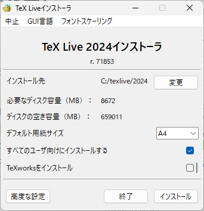

# TeXを使って文書を書こう

---

TeXは1978年にスタンフォード大学のドナルド・クヌース教授によって開発された、きれいな数式を書くための組版ソフトです。

TeXは、その高度な数式表現能力と美しい組版により、学術や専門的な文書作成だけでなく、様々な分野で重要なツールとなっています。

1982年にTeXの最初の安定版がリリースされ、その後1989年にLaTeXが登場しました。

LaTeXはTeXをより使いやすくするためのマクロパッケージで、現在も広く使用されています。

本記事は、LaTeXをローカル環境に導入するまでのプロセスをまとめたものになっています。

なお、OverleafやCloud LaTeXなどを用いて、オンラインエディタ上でTeX文書を作成することもできます。

# TeX Liveのインストール

---

TeXをローカルで書くためには、TeX Liveというディストリビューションを用いるのが一般的です。

Macの場合はMacTeXというのもよく使われます。

詳しいインストール方法は[TeX wiki｜TeX入手法](https://texwiki.texjp.org/?TeX%E5%85%A5%E6%89%8B%E6%B3%95)に書かれているので割愛します。

<aside class="pinned">

ネットワークインストーラのリンク：[Installing TeX Live over the Internet](https://www.tug.org/texlive/acquire-netinstall.html)

</aside>

インストールには4時間程度？かかります。

# インストール時のオプション

---

TeX Liveインストール時には、TeXworksを同時にインストールするかを聞かれます。

筆者としては、TeXworksはエディタとして使いにくいので、より高機能で初心者～上級者まで使いやすいTeXStudioがオススメです。

[TeXstudioの導入方法についてはこちら。](/TeX/TeXstudio/TeXstudio.md)

TeXworksをインストールしない場合には、オプションのチェックを外します。

