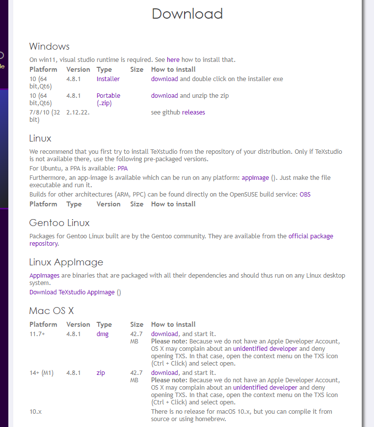
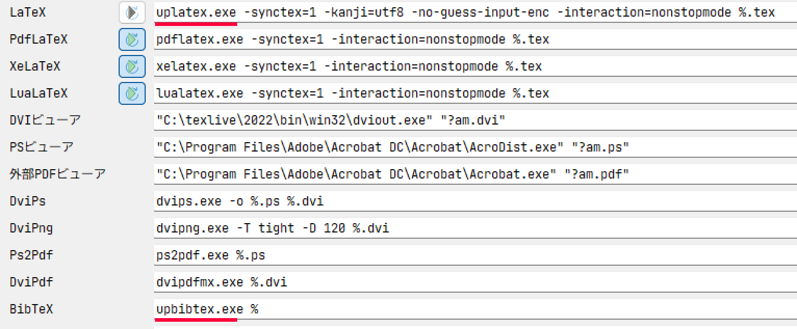
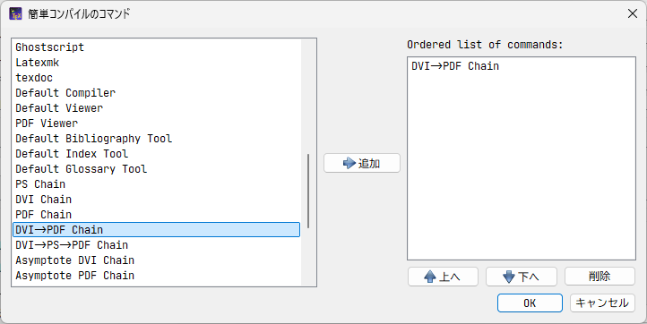
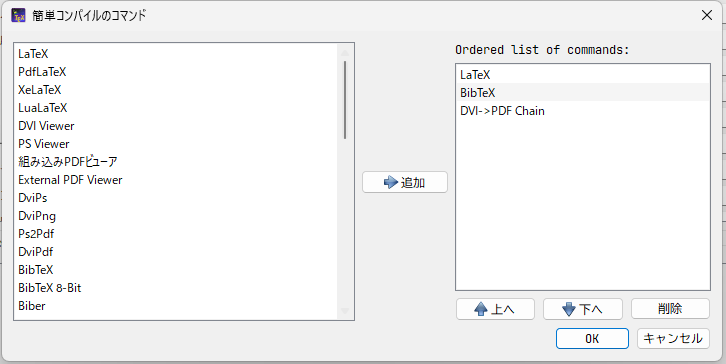
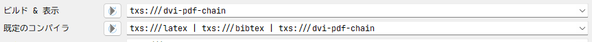

# 前提

---

- TeXのインストール方法は、[TeX Liveのインストール](/TeX/TeXLive/TeXLive-install.md)を参照してください。

# エディタとは

---

TeXでつくる文書はテキストベースなので、メモ帳などで書いてコンパイルしても良いのですが、TeXの記述に特化したエディタを使うことで作業効率を高めることができます。

筆者はTeXstudioというエディタを使用しています（使用環境はWindows11です）。

特にこだわりのエディタがない場合には、使い勝手が良いのでおすすめです。

また、Overleafなどのオンラインエディタもおすすめです。

ローカルに環境構築せずにLaTeX文書を打てるので、アカウントを持っておくと良いでしょう。

Overleafの導入については[オンラインエディタを使う(Overleafの場合)](/TeX/TeXLive/Overleaf.md)を参照。

# TeXstudioの導入

---

1. [TeXstudioの公式サイト](https://www.texstudio.org/)から、最新版をダウンロードします。
    
    
    
2. ダウンロード後、解凍してインストーラを起動します。TeX Liveと違ってすぐに終わります。

# コンパイラの初期設定

---

最初に使用する前にいくつか初期設定をします。

## コマンド設定

1. 左下の「高度なオプション」にチェックがない場合、チェックを入れます。
2. 上部メニューのオプション>コマンドから、コマンド設定を以下のように変更します。
    - **LaTeX：** 
    `uplatex.exe -synctex=1 -kanji=utf8 -no-guess-input-enc -interaction=nonstopmode %.tex`
    - **BibTeX：** 
    `upbibtex.exe %`
    
    
    

## コンパイラ設定

1. オプション>ビルドから、「ビルド＆表示」の欄の歯車マークを押します。
2. 「Ordered list of commands」が下のようにDVI→PDF Chainのみになるようにします。
    
    
    
3. 同様に、「既定のコンパイラ」は、LaTeX　>　BibTeX　>　DVI→PDF Chainの順になるようにします（順番に注意）。
    
    
    
    
4. 次のようになっていたらOKです。この設定で、キーボードの「F5」キーで通常のコンパイル、「F6」キーでBibTeXを含めたコンパイルができるようになります。
    
    
    

# 実際に文章を打ってみる

---

インストールおよびコンパイラの設定ができたら、実際にテストで文書をコンパイルしてみましょう。

テスト用の文書は[LaTeX文書を書いてみる](/TeX/LaTeX-beginner/LaTeX-beginner.md) を参照。