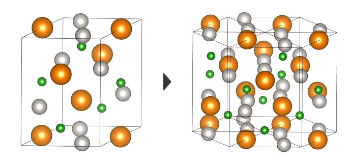
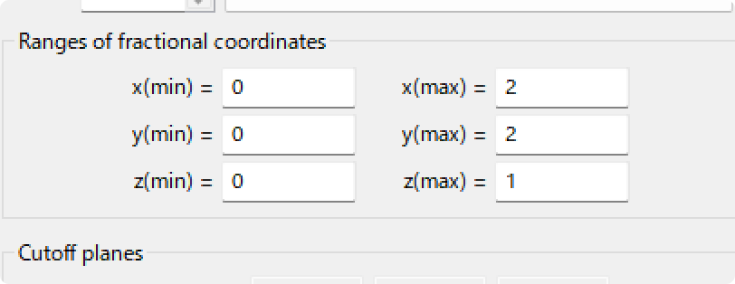
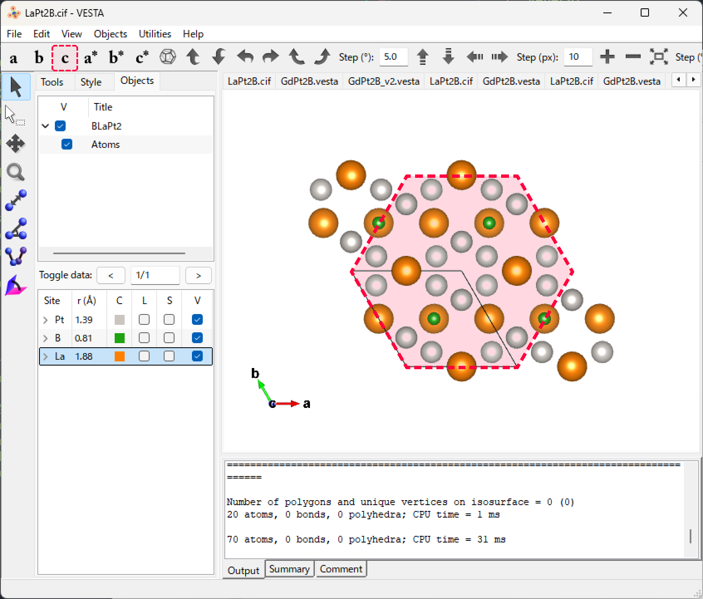

# はじめに

---

VESTAで六方晶系をそれっぽくする方法です。

cifファイルを読み込んだりしたときに、六方晶だとほとんどの場合は基本単位胞（下の図の左側）として表示されます。

しかしながら、六方晶系の場合は、六角柱の形を単位胞（プリミティブの場合の3倍の大きさ）として描写したいときもあると思います。

そこで下の図のように、六角柱の単位胞をVESTAで実現してみましょう。

# やり方

---

1. VESTAで対象ののファイルを開きます。
2. 上部メニューから`Objects > Boundary…`を開きます。
3. *x* (max) と *y* (max) を「2」にしてOKします。*a*軸、*b*軸の方向に原子が描画される範囲が拡張されます。

    
    
4. *c*軸方向からみたビューに切り替えます。左上の「*c*」を押すと切り替えられます。
    
    

5. いらない原子核を消すために、残したい部分を考えます。上図でいうと赤で囲んだ部分が残す部分です。
6. 左のバーからSelect（上から2番目、白カーソルと四角のアイコン）を選びます。
   いらない原子をドラッグして選択します。選択した原子は、キーボードのDeleteを押すと消えます。
7. 消し終わったら、左のバーでRotate（1番上の黒カーソル）を選んで、好きな方向にして画像を保存します。

なお、単位胞のガイド線については、どうやってこの形を作ればいいのかわからないため、筆者はいつもパワポなどのツールで書いています（もしかしたら、もっといいやりかたがあるのかも…）。

1つの単位胞に線を表示させたものと、線なしにしたものを2つ出力して、見比べながら線を引くと書きやすいです。

単位胞の線は、`Objects > Properties > General…` から変更できます。